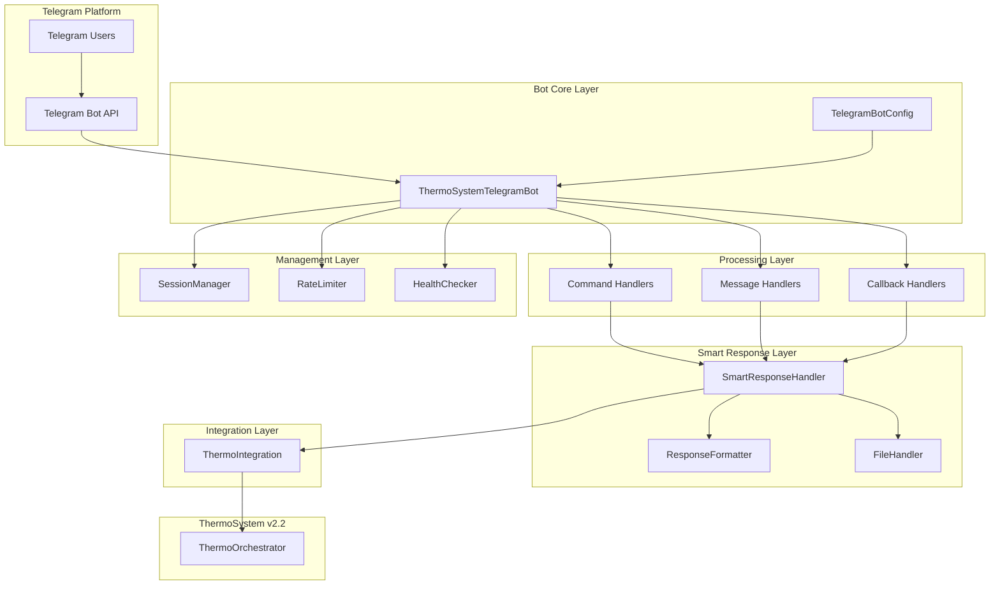
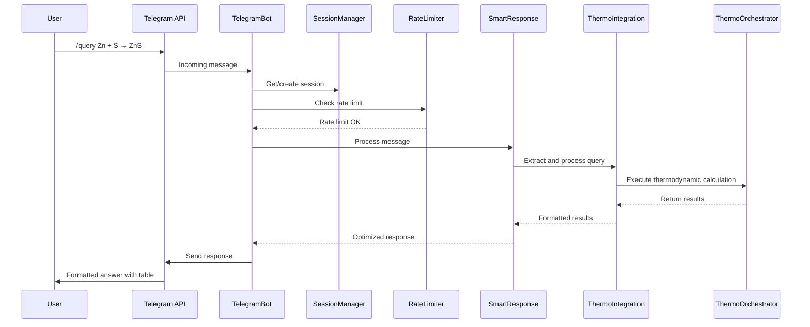
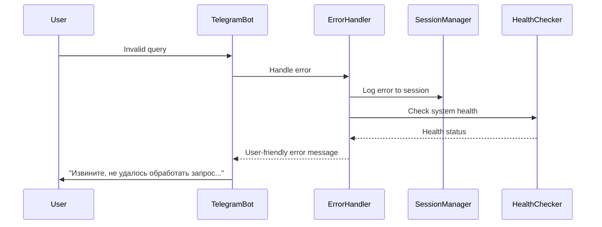

# Telegram Bot Architecture

## Обзор архитектуры

**TelegramBotSystem** - это производительная система интеграции Telegram бота с ThermoSystem v2.2, использующая гибридную архитектуру с четким разделением между обработкой сообщений и научными вычислениями.

### Основные компоненты

#### **Ядро бота (Bot Core)**
- **ThermoSystemTelegramBot** - Основной класс бота с интегрированной логикой
- **TelegramBotConfig** - Централизованная конфигурация через dataclass
- **ErrorHandler** - Обработка ошибок с user-friendly сообщениями

#### **Система команд (Command System)**
- **CommandHandler** - Базовый класс обработки команд
- **AdminCommands** - Административные команды с проверкой прав доступа
- **CommandRouter** - Маршрутизация команд соответствующим обработчикам

#### **Обработка сообщений (Message Processing)**
- **MessageHandler** - Обработка текстовых сообщений
- **CallbackHandler** - Обработка inline кнопок и callback'ов
- **SmartResponseHandler** - Оптимизация ответов и форматирование

#### **Интеграционный слой (Integration Layer)**
- **ThermoIntegration** - Адаптер для взаимодействия с ThermoOrchestrator
- **ResponseFormatter** - Форматирование ответов для Telegram
- **FileHandler** - Генерация и обработка файлов

#### **Управление сессиями (Session Management)**
- **SessionManager** - Управление пользовательскими сессиями
- **RateLimiter** - Ограничение частоты запросов
- **ActivityTracker** - Отслеживание активности пользователей

#### **Мониторинг и здоровье системы (Health & Monitoring)**
- **HealthChecker** - Фоновые проверки здоровья системы
- **MetricsCollector** - Сбор метрик использования
- **Logger** - Структурированное логирование сессий

## Архитектурная диаграмма



## Структура кода

```
src/thermo_agents/telegram_bot/
├── __init__.py
├── bot.py                      # Основной класс бота
├── config.py                   # Конфигурация системы
├── exceptions.py               # Специфические исключения
├── utils/                      # Утилиты и вспомогательные модули
│   ├── __init__.py
│   ├── thermo_integration.py   # Адаптер ThermoSystem
│   ├── session_manager.py      # Управление сессиями
│   ├── rate_limiter.py         # Ограничение частоты запросов
│   ├── health_checker.py       # Проверки здоровья
│   ├── error_handler.py        # Обработка ошибок
│   └── activity_tracker.py     # Отслеживание активности
├── handlers/                   # Обработчики сообщений
│   ├── __init__.py
│   ├── message_handler.py      # Обработка текстовых сообщений
│   ├── callback_handler.py     # Обработка callback'ов
│   └── command_handler.py      # Базовый класс команд
├── commands/                   # Команды бота
│   ├── __init__.py
│   ├── admin_commands.py       # Административные команды
│   ├── user_commands.py        # Пользовательские команды
│   └── system_commands.py      # Системные команды
├── managers/                   # Менеджеры логики
│   ├── __init__.py
│   └── smart_response.py       # Умная обработка ответов
├── formatters/                 # Форматирование вывода
│   ├── __init__.py
│   ├── response_formatter.py   # Форматирование ответов
│   └── file_handler.py         # Обработка файлов
└── monitoring/                 # Мониторинг и метрики
    ├── __init__.py
    ├── metrics.py              # Сбор метрик
    └── dashboard.py            # Дашборд мониторинга
```

## Потоки выполнения

### Основной поток обработки запроса



### Поток обработки ошибок



## Ключевые архитектурные паттерны

### 1. **Dependency Injection через конфигурацию**
```python
@dataclass
class TelegramBotConfig:
    # Telegram API settings
    bot_token: str
    webhook_url: Optional[str] = None

    # ThermoSystem integration
    thermo_config: ThermoOrchestratorConfig

    # Rate limiting
    max_requests_per_minute: int = 10
    max_sessions_per_user: int = 3

    # Monitoring
    health_check_interval: int = 60
    enable_metrics: bool = True
```

### 2. **Асинхронная обработка запросов**
```python
class ThermoSystemTelegramBot:
    async def handle_message(self, message: Message) -> None:
        session = await self.session_manager.get_session(message.chat_id)
        async with self.rate_limiter.acquire(message.chat_id):
            response = await self.smart_handler.process(message, session)
            await message.reply_text(response)
```

### 3. **Graceful Degradation**
- Fallback на кэшированные результаты при недоступности ThermoSystem
- Упрощенные ответы при ограничениях Telegram API
- Альтернативные форматы вывода при ошибках форматирования

### 4. **Session-based архитектура**
```python
@dataclass
class UserSession:
    session_id: str
    user_id: int
    chat_id: int
    created_at: datetime
    last_activity: datetime
    query_count: int = 0
    context: Dict[str, Any] = field(default_factory=dict)
```

## Интеграция с ThermoSystem

### ThermoIntegration Adapter

```python
class ThermoIntegration:
    def __init__(self, orchestrator: ThermoOrchestrator):
        self.orchestrator = orchestrator

    async def process_query(
        self,
        query: str,
        session_context: Dict[str, Any]
    ) -> TelegramResponse:
        # Извлечение параметров из контекста Telegram
        extracted = await self.extract_parameters(query, session_context)

        # Выполнение расчетов через ThermoOrchestrator
        results = await self.orchestrator.calculate_reaction(extracted)

        # Форматирование для Telegram
        return await self.format_for_telegram(results)
```

### Mapping between Telegram и ThermoSystem

| Telegram Concept | ThermoSystem Mapping |
|------------------|---------------------|
| Текстовое сообщение | ExtractedReactionParameters |
| Inline кнопки | FilterPipeline options |
| Файловые ответы | TableFormatter export |
| Сессия пользователя | AgentStorage session |
| Rate limiting | Request throttling |

## Конфигурация и развертывание

### Environment Variables

```bash
# Telegram Bot Configuration
TELEGRAM_BOT_TOKEN=your_bot_token_here
TELEGRAM_WEBHOOK_URL=https://your-domain.com/webhook

# ThermoSystem Integration
OPENROUTER_API_KEY=your_openrouter_key
DB_PATH=data/thermo_data.db

# Rate Limiting
MAX_REQUESTS_PER_MINUTE=10
MAX_CONCURRENT_SESSIONS=100

# Monitoring
ENABLE_HEALTH_CHECKS=true
HEALTH_CHECK_INTERVAL=60
LOG_LEVEL=INFO
```

### Deployment Modes

#### 1. **Polling Mode (Development)**
```python
bot = ThermoSystemTelegramBot(config=config)
await bot.start_polling()
```

#### 2. **Webhook Mode (Production)**
```python
bot = ThermoSystemTelegramBot(config=config)
await bot.setup_webhook(url=config.webhook_url)
```

## Мониторинг и наблюдаемость

### Health Checks

```python
@dataclass
class HealthStatus:
    bot_status: str  # "healthy", "degraded", "unhealthy"
    thermo_system_status: str
    active_sessions: int
    requests_per_minute: float
    error_rate: float
    last_check: datetime
```

### Metrics Collection

- Активные сессии
- Запросы в минуту
- Время ответа
- Rate of errors
- Память и CPU использование
- ThermoSystem availability

## Безопасность

### 1. **Authentication & Authorization**
- Проверка bot token
- Ролевой доступ для административных команд
- Валидация входных данных

### 2. **Rate Limiting**
- Per-user rate limiting
- Global rate limiting
- Session limits

### 3. **Privacy & Data Protection**
- Локальное хранение сессий
- Очистка старых сессий
- Опциональное шифрование контекста

## Тестирование

### Test Structure

```
tests/telegram_bot/
├── unit/                        # Unit тесты компонентов
│   ├── test_bot.py             # Тесты основного класса бота
│   ├── test_session_manager.py  # Тесты управления сессиями
│   ├── test_rate_limiter.py    # Тесты ограничения частоты
│   └── test_thermo_integration.py # Тесты интеграции
├── integration/                 # Интеграционные тесты
│   ├── test_end_to_end.py      # Сквозные тесты
│   ├── test_error_handling.py  # Тесты обработки ошибок
│   └── test_health_checks.py   # Тесты здоровья системы
└── e2e/                        # End-to-End тесты
    ├── test_user_workflows.py  # Тесты пользовательских сценариев
    └── test_admin_features.py  # Тесты административных функций
```

### Testing Strategies

1. **Unit Tests** - Тестирование отдельных компонентов
2. **Integration Tests** - Тестирование взаимодействия компонентов
3. **Mock Telegram API** - Эмуляция Telegram для изолированного тестирования
4. **Load Testing** - Тестирование производительности под нагрузкой
5. **Chaos Testing** - Тестирование устойчивости к сбоям

## Производительность и оптимизация

### Performance Targets

- **Response Time**: < 5 секунд для типичных запросов
- **Throughput**: 100+ одновременных пользователей
- **Memory Usage**: < 500MB для базовой конфигурации
- **Error Rate**: < 1% для нормальной нагрузки

### Optimization Strategies

1. **Response Caching** - Кэширование результатов типичных запросов
2. **Session Pooling** - Переиспользование сессий
3. **Lazy Loading** - Загрузка ThermoSystem по требованию
4. **Background Processing** - Фоновая обработка тяжелых запросов
5. **Connection Pooling** - Пулы соединений с базой данных

## Расширение и масштабирование

### Horizontal Scaling

```python
# Multiple bot instances with shared session storage
@dataclass
class BotClusterConfig:
    bot_instances: List[TelegramBotConfig]
    shared_session_backend: str  # "redis", "database"
    load_balancer: str
```

### Plugin Architecture

```python
class TelegramBotPlugin:
    async def on_message(self, message: Message) -> Optional[Response]:
        pass

    async def on_command(self, command: Command) -> Optional[Response]:
        pass
```

## Заключение

Архитектура TelegramBotSystem следует тем же принципам чистоты и производительности, что и ThermoSystem v2.2:

1. **Четкое разделение ответственности** между обработкой сообщений и научными вычислениями
2. **Асинхронная обработка** для высокой производительности
3. **Graceful degradation** для надежности в production
4. **Комплексный мониторинг** для operational excellence
5. **Модульная тестируемость** для быстрой разработки и отладки

Эта архитектура обеспечивает масштабируемое, надежное и поддерживаемое решение для интеграции сложных научных вычислений с популярной messaging платформой.