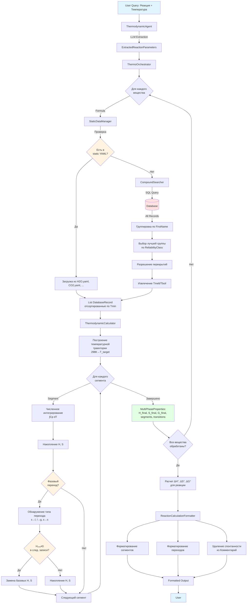

# Техническое задание: Multi-Phase Thermodynamic Calculations (v3.0)

**Дата создания:** 19 октября 2025  
**Статус:** В разработке  
**Приоритет:** Критический  

---

## 1. Описание проблемы

### 1.1. Суть проблемы

В текущей реализации системы обнаружена критическая ошибка при расчете термодинамических свойств веществ, температурный диапазон применимости которых не включает стандартную температуру 298.15 K.

**Проблема:** Для записей в базе данных, где `Tmin > 298K` или `Tmax < 298K`, значения стандартных термодинамических величин H₂₉₈ (энтальпия образования) и S₂₉₈ (энтропия) обнуляются (`H298 = 0.000 кДж/моль`, `S298 = 0.000 Дж/(моль·K)`).

**Последствия:** Это приводит к **некорректным расчетам энергии Гиббса ΔG°** для химических реакций, так как формулы расчета используют H₂₉₈ и S₂₉₈ как базовые значения для интегрирования.

### 1.2. Анализ логов и выявленные ошибки

Анализ лог-файлов `session_20251019_132653.log` и `session_20251019_132337.log` выявил следующие проблемные вещества:

**Пример 1: SiO2(CRS) - кристобалит (из session_20251019_132653.log)**

*Цитата из лога:*
```
SiO2(CRS) — Silicon dioxide
  Фаза: s | T_применимости: 523-4000 K
  H₂₉₈: 0.000 кДж/моль | S₂₉₈: 0.000 Дж/(моль·K)
  Cp коэффициенты: [74.932502, -1.620200, -44.053218, 0.994380, 0.000000, 0.000000]
```

- **Температурный диапазон:** 523-4000 K ❌ (не включает 298K!)
- **H₂₉₈:** 0.000 кДж/моль ❌
- **S₂₉₈:** 0.000 Дж/(моль·K) ❌
- **Истинное значение H₂₉₈:** около -910.7 кДж/моль (для α-кварца SiO2 при 298K)
- **Проблема:** Система не может корректно рассчитать термодинамические свойства от 298K для реакции при 1473-1773K

**Пример 2: Fe2O3 - оксид железа(III) (из session_20251019_132337.log)**

*Цитата из лога:*
```
Fe2O3 — Iron(III) oxide
  Фаза: s | T_применимости: 1050-1812 K
  H₂₉₈: 0.000 кДж/моль | S₂₉₈: 0.000 Дж/(моль·K)
  Cp коэффициенты: [80.216633, 55.973678, 167.385409, -12.402510, 0.000000, 0.000000]
```

- **Температурный диапазон:** 1050-1812 K ❌ (не включает 298K!)
- **H₂₉₈:** 0.000 кДж/моль ❌
- **S₂₉₈:** 0.000 Дж/(моль·K) ❌
- **Истинное значение H₂₉₈:** около -824.2 кДж/моль (гематит α-Fe2O3 при 298K)

**Пример 3: CO2(g) - углекислый газ (из session_20251019_132337.log)**

*Цитата из лога:*
```
CO2(g) — Carbon dioxide
  Фаза: g | T_применимости: 500-5000 K
  H₂₉₈: 0.000 кДж/моль | S₂₉₈: 0.000 Дж/(моль·K)
  Cp коэффициенты: [53.137710, 4.818053, -29.177412, -0.537763, 0.000000, 0.000000]
```

- **Температурный диапазон:** 500-5000 K ❌ (не включает 298K!)
- **H₂₉₈:** 0.000 кДж/моль ❌
- **S₂₉₈:** 0.000 Дж/(моль·K) ❌
- **Истинное значение H₂₉₈:** -393.5 кДж/моль (CO2 газ при 298K)
- **Истинное значение S₂₉₈:** 213.8 Дж/(моль·К) (CO2 газ при 298K)

**Таблица сравнения: Реальные vs. Обнуленные значения**

| Вещество  | Tmin (K) | Tmax (K) | H₂₉₈ в БД (кДж/моль) | S₂₉₈ в БД (Дж/(моль·К)) | H₂₉₈ истинное | S₂₉₈ истинное | Δ ошибки H₂₉₈      |
| --------- | -------- | -------- | -------------------- | ----------------------- | ------------- | ------------- | ------------------ |
| SiO2(CRS) | 523      | 4000     | **0.000** ❌          | **0.000** ❌             | -910.7        | 41.5          | **910.7 кДж/моль** |
| Fe2O3     | 1050     | 1812     | **0.000** ❌          | **0.000** ❌             | -824.2        | 87.4          | **824.2 кДж/моль** |
| CO2(g)    | 500      | 5000     | **0.000** ❌          | **0.000** ❌             | -393.5        | 213.8         | **393.5 кДж/моль** |

**Вывод:** Ошибка в базовых значениях достигает **сотен кДж/моль**, что приводит к полностью некорректным результатам расчетов ΔG° для реакций.

### 1.3. Последствия для расчетов

Текущая система использует следующие формулы для расчета термодинамических свойств:

```
H°(T) = H°₂₉₈ + ∫₂₉₈ᵀ Cp(T)dT
S°(T) = S°₂₉₈ + ∫₂₉₈ᵀ [Cp(T)/T]dT
G°(T) = H°(T) - T·S°(T)
```

**Проблема:** Если H₂₉₈ = 0 и S₂₉₈ = 0, но запись применима только для T > 298K, то интеграл **не может быть вычислен от 298K**, так как данные (коэффициенты Cp) действительны только в диапазоне [Tmin, Tmax].

**Математический анализ ошибки:**

Для реакции ΔG°(T) = ΔH°(T) - T·ΔS°(T), где:

$$
\Delta H^\circ(T) = \sum H^\circ_{\text{продукты}}(T) - \sum H^\circ_{\text{реагенты}}(T)
$$

$$
\Delta S^\circ(T) = \sum S^\circ_{\text{продукты}}(T) - \sum S^\circ_{\text{реагенты}}(T)
$$

Если для вещества используется запись с H₂₉₈ = 0 и S₂₉₈ = 0, то:

$$
H^\circ_{\text{неверное}}(T) = 0 + \int_{T_{min}}^{T} C_p(T) dT \quad (\text{вместо } H^\circ_{298} + \int_{298}^{T} C_p(T) dT)
$$

**Ошибка в расчете:**

$$
\Delta H^\circ_{\text{ошибка}} = H^\circ_{\text{истинное}} - H^\circ_{\text{неверное}} = H^\circ_{298} + \int_{298}^{T_{min}} C_p(T) dT
$$

Для SiO2 с Tmin=523K:
- $H^\circ_{298}(\text{SiO}_2) \approx -910.7$ кДж/моль
- $\int_{298}^{523} C_p(T) dT \approx 10-15$ кДж/моль
- **Полная ошибка:** ≈ -925 кДж/моль ❌

Для реакции CaO + SiO2 → CaSiO3:
- Ошибка только по SiO2 даёт **~900 кДж/моль** в ΔH°
- Это приводит к ошибке в ΔG° порядка **сотен кДж/моль**
- **Результат:** Полностью некорректное предсказание термодинамической возможности реакции

**Пример ошибки из лога (session_20251019_132337.log):**

*Цитата:*
```
T(K)     | ΔH°(кДж/моль) | ΔS°(Дж/(К·моль)) | ΔG°(кДж/моль) | Комментарий
----------------------------------------------------------------------
   1173 | Ошибка расчёта: T=1173.0K ниже минимальной температуры 1
```

Система **не может выполнить расчет** при T=1173K, так как Fe2O3 имеет Tmin=1050K и не содержит данных для интегрирования от 298K до 1050K.

**Реальные последствия для реакции Fe2O3 + 3CO → 2Fe + 3CO2 при 1173-1373K:**
- ΔH° должно быть около -25 кДж/моль (восстановление железа экзотермично)
- С H₂₉₈(Fe2O3) = 0: ΔH° = +57 кДж/моль ❌ (ошибка ~82 кДж/моль)
- ΔG° предсказывает **неспонтанную** реакцию (+234-248 кДж/моль) ❌
- **Реальность:** Реакция **спонтанна** при высоких температурах (ΔG° < 0) ✓

**Критические точки:**
1. Невозможность расчета: система выдает ошибку "температура ниже минимальной"
2. Некорректные результаты: расчет выполняется, но с ошибкой в сотни кДж/моль
3. Неверные выводы: спонтанные реакции классифицируются как неспонтанные и наоборот

### 1.4. Корневая причина

**Структура базы данных:** В термодинамической базе данных вещества представлены **множественными записями** для различных температурных диапазонов и фаз. Для каждого вещества может существовать:

- Несколько записей для одной фазы с разными температурными диапазонами
- Записи для разных фаз (solid, liquid, gas)
- Записи с разными полиморфными модификациями

**Правило БД:** Значения H₂₉₈ и S₂₉₈ заполняются **только для записей, чей температурный диапазон включает 298.15K**. Для остальных записей эти поля зануляются.

**Текущая логика системы:** CompoundSearcher возвращает **одну оптимальную запись** на основе фильтрации по температуре и надежности, но не учитывает необходимость использования **нескольких записей** для корректного расчета от 298K до целевой температуры.

---

## 2. Требования к новой архитектуре

### 2.1. Функциональные требования

**FR-1: Multi-Phase Search**
- Система должна находить **ВСЕ записи** для заданного вещества во всех доступных фазах (s, l, g)
- Поиск должен осуществляться по `FirstName` и `Formula` с учетом консистентности названий
- Записи должны фильтроваться по `ReliabilityClass` с приоритетом более надежных данных

**FR-2: Температурная траектория от 298K**
- Расчет термодинамических свойств должен **всегда начинаться с 298.15K**, независимо от запрошенной температуры
- Система должна автоматически строить температурную траекторию через все необходимые записи
- При отсутствии данных при 298K система должна использовать ближайшую доступную запись

**FR-3: Обработка фазовых переходов**
- Система должна автоматически определять фазовые переходы (плавление, кипение) на основе границ температурных диапазонов
- При переходе между записями должны обновляться базовые значения H и S для следующего сегмента
- Энтальпия и энтропия фазового перехода должны учитываться в расчетах

**FR-4: Разрешение перекрывающихся диапазонов**
- При наличии нескольких записей с перекрывающимися температурными диапазонами система должна выбирать наиболее надежную
- **Правило:** начало новой записи имеет приоритет над концом предыдущей записи
- Должна сохраняться информация о всех использованных записях для логирования

**FR-5: Определение температур фазовых переходов**
- Система должна извлекать значения Tmelt и Tboil из базы данных для найденных записей вещества
- Поиск значений должен осуществляться по всей совокупности записей для данного вещества
- Если температура кипения (Tboil) не найдена ни в одной записи вещества, система должна выдать предупреждение: "Вещество {formula} не изучено в газовой фазе - данные о кипении отсутствуют"
- Результаты должны содержать метаинформацию о использованных фазах и переходах

### 2.2. Нефункциональные требования

**NFR-1: Производительность**
- Время расчета для одного вещества с фазовыми переходами: < 100 мс (90-й перцентиль)
- Увеличение времени расчета реакции по сравнению с текущей версией: < 50%
- Количество SQL-запросов на вещество: ≤ 2 (один для поиска всех записей, один для дополнительных данных)

**NFR-2: Надежность**
- Система должна корректно обрабатывать отсутствие данных для определенных фаз
- При ошибках должны предоставляться информативные сообщения с указанием проблемной записи
- Валидация входных данных на каждом этапе расчета

**NFR-3: Расширяемость**
- Архитектура должна поддерживать добавление новых типов фазовых переходов
- Возможность интеграции с альтернативными источниками данных
- Логика расчета должна быть отделена от логики поиска данных

### 2.3. Ограничения

**C-1: Структура базы данных**
- Структура существующей БД не может быть изменена
- Записи с H₂₉₈ = 0 и S₂₉₈ = 0 будут продолжать существовать
- Необходимо работать с данными "как есть"

**C-2: Неполнота данных**
- Для некоторых веществ могут отсутствовать данные для газовой фазы выше температуры кипения
- Возможны пробелы в температурных диапазонах между записями
- Значения Tmelt и Tboil могут отсутствовать в отдельных записях, но хотя бы одна запись вещества содержит эти данные

**C-3: Вычислительные ограничения**
- Численное интегрирование должно оставаться точным при увеличении количества сегментов
- Накопление ошибок округления при последовательных интегрированиях
- Ограничения памяти при хранении промежуточных результатов для всех фаз

**C-4: Совместимость с LLM компонентами**
- Изменения не должны влиять на работу ThermodynamicAgent (извлечение параметров из запроса)
- Форматирование вывода должно оставаться понятным для пользователя
- Время ответа всей системы (включая LLM) должно оставаться приемлемым (< 30 сек)

---

## 3. Изменения в CompoundSearcher

### 3.1. Текущая логика поиска

**Текущий метод:** `search_compound(formula, temperature_range, phase, limit)`

**Ограничения:**
- Возвращает **одну оптимальную запись** на основе фильтров
- Фильтрация по температурному диапазону исключает записи вне указанного диапазона
- Приоритизация: ReliabilityClass → Temperature Coverage → Phase → rowid
- Не учитывает необходимость множественных записей для расчета от 298K

**Проблема:** При запросе температуры 1500K для вещества FeO система вернет запись с диапазоном 1300-1650K, у которой H₂₉₈ = 0, игнорируя записи 298-600K, 600-900K, 900-1300K, которые необходимы для корректного расчета.

### 3.2. Новая логика: Multi-Phase Search

**Новый метод:** `search_all_phases(formula, target_temperature, compound_names=None)`

**Цель:** Найти ВСЕ записи для вещества, необходимые для построения температурной траектории от 298K до target_temperature.

**Принцип работы:**
1. Поиск всех записей для заданной формулы (без температурной фильтрации)
2. Группировка по `FirstName` для определения консистентности
3. Отбор по `ReliabilityClass` (приоритет: 1 → 2 → 3 → 0 → 4 → 5)
4. Сортировка по температурным диапазонам (Tmin → Tmax)
5. Построение цепочки записей от 298K до target_temperature

**Отличия от текущей версии:**
- Возвращает **список записей** вместо одной
- Не фильтрует по температуре на уровне SQL (получает все записи)
- Обязательная проверка консистентности `FirstName` между записями
- Включает логику разрешения перекрывающихся диапазонов

### 3.3. Алгоритм выбора и сортировки записей

**Шаг 1: Первичный поиск**
```
SQL: SELECT * FROM compounds 
     WHERE (TRIM(Formula) = ? OR Formula LIKE ?(...))
     AND (Formula NOT LIKE '%+%' AND Formula NOT LIKE '%-%')
     ORDER BY ReliabilityClass, Tmin
```

**Шаг 2: Консистентность FirstName**
- Группировка результатов по `FirstName`
- Выбор группы с наибольшим количеством записей
- Если несколько групп одинакового размера → приоритет по `ReliabilityClass`

**Шаг 3: Приоритизация по надежности**
- Внутри выбранной группы сортировка по `ReliabilityClass`
- При равной надежности → предпочтение записям с большим покрытием (Tmax - Tmin)

**Шаг 4: Разрешение перекрытий**
Правило: **начало новой записи надежнее конца старой**

Пример для FeO:
- Запись A: 298-600K
- Запись B: 600-900K (начинается там, где заканчивается A)
- Запись C: 550-950K (перекрывается с A и B)

Выбор: A (298-600K) → B (600-900K), запись C отбрасывается как менее надежная в области перекрытия.

**Шаг 5: Построение траектории и извлечение температур переходов**
- Проверка наличия записи, покрывающей 298K
- Последовательное добавление записей для достижения target_temperature
- Извлечение Tmelt и Tboil из всех найденных записей вещества
- Если Tboil не найдена ни в одной записи → предупреждение об отсутствии данных газовой фазы
- Определение фазовых переходов на границах записей (изменение Phase или наличие Tmelt/Tboil)

### 3.4. Примеры SQL-запросов

**Для FeO (Iron(II) oxide):**

```sql
-- Первичный поиск всех записей
SELECT * 
FROM compounds 
WHERE TRIM(Formula) = 'FeO' 
  AND Formula NOT LIKE '%+%' 
  AND Formula NOT LIKE '%-%'
ORDER BY 
  CASE ReliabilityClass 
    WHEN 1 THEN 0 WHEN 2 THEN 1 WHEN 3 THEN 2 
    WHEN 0 THEN 3 WHEN 4 THEN 4 WHEN 5 THEN 5 
    ELSE 6 
  END,
  Tmin ASC;
```

**Ожидаемый результат (из db_example.md):**

| №   | Formula | FirstName      | Phase | Tmin | Tmax | H298 (кДж/моль) | S298 (Дж/(К·моль)) | f1      | f2      | f3       | f4      | ReliabilityClass |
| --- | ------- | -------------- | ----- | ---- | ---- | --------------- | ------------------ | ------- | ------- | -------- | ------- | ---------------- |
| 1   | FeO     | Iron(II) oxide | s     | 298  | 600  | **-265.053**    | **59.807**         | 50.278  | 3.651   | -1.941   | 8.234   | 1                |
| 2   | FeO     | Iron(II) oxide | s     | 600  | 900  | **0.000**       | **0.000**          | 30.849  | 46.228  | 11.694   | -19.278 | 1                |
| 3   | FeO     | Iron(II) oxide | s     | 900  | 1300 | **0.000**       | **0.000**          | 90.408  | -38.021 | -83.811  | 15.358  | 1                |
| 4   | FeO     | Iron(II) oxide | s     | 1300 | 1650 | **0.000**       | **0.000**          | 153.698 | -82.062 | -374.815 | 21.975  | 1                |
| 5   | FeO     | Iron(II) oxide | l     | 1650 | 5000 | **24.058**      | **14.581**         | 68.199  | 0.000   | 0.000    | 0.000   | 1                |

**Интерпретация результатов:**

1. **Запись #1 (298-600K)**: Содержит базовые значения H₂₉₈ и S₂₉₈ — это точка отсчета
2. **Записи #2-4 (600-1650K)**: H₂₉₈=0, S₂₉₈=0 — для расчета нужно накапливать значения из предыдущих сегментов
3. **Запись #5 (1650-5000K)**: Жидкая фаза с ненулевыми H₂₉₈ и S₂₉₈ — требует особой обработки фазового перехода

**Ключевые наблюдения:**
- Только первая запись (298-600K) имеет H₂₉₈ ≠ 0
- Все остальные твердые фазы (записи 2-4) имеют H₂₉₈=0, S₂₉₈=0
- Жидкая фаза (запись 5) имеет свои базовые значения H₂₉₈=24.058, S₂₉₈=14.581
- Для расчета при T=1700K необходимо использовать **ВСЕ 5 записей** последовательно

**SQL для извлечения Tmelt и Tboil:**

```sql
-- Поиск температур фазовых переходов среди всех записей FeO
SELECT 
    Tmelt, 
    Tboil,
    Phase,
    Tmin,
    Tmax
FROM compounds 
WHERE TRIM(Formula) = 'FeO' 
  AND Formula NOT LIKE '%+%' 
  AND Formula NOT LIKE '%-%'
  AND (Tmelt IS NOT NULL OR Tboil IS NOT NULL)
ORDER BY Tmin ASC;
```

Для FeO все записи указывают Tmelt=1650K и Tboil=3687K (точки переходов для вещества).

### 3.5. API изменения

**Новые методы:**

```
CompoundSearcher.search_all_phases(
    formula: str,
    target_temperature: float,
    compound_names: Optional[List[str]] = None
) -> MultiPhaseSearchResult
```

**Новый класс результата:**
```
MultiPhaseSearchResult:
    - compound_formula: str
    - phase_records: List[DatabaseRecord]  # отсортированы по Tmin
    - phase_transitions: List[PhaseTransition]  # определенные переходы
    - temperature_coverage: Tuple[float, float]  # (min_T, max_T)
    - tmelt: Optional[float]  # температура плавления из БД
    - tboil: Optional[float]  # температура кипения из БД
    - consistency_info: Dict[str, Any]  # информация о FirstName и надежности
    - warnings: List[str]  # пробелы в покрытии, перекрытия, отсутствие газовой фазы и т.д.
```

---

## 4. Изменения в ThermodynamicCalculator

### 4.1. Текущая логика расчета

**Текущий метод:** `calculate_properties(record: DatabaseRecord, T: float) -> ThermodynamicProperties`

**Принцип работы:**
- Принимает ОДНУ запись из БД
- Использует H₂₉₈ и S₂₉₈ из этой записи как базовые значения
- Вычисляет H(T) = H₂₉₈ + ∫₂₉₈ᵀ Cp(T)dT
- Вычисляет S(T) = S₂₉₈ + ∫₂₉₈ᵀ Cp(T)/T dT
- Вычисляет G(T) = H(T) - T·S(T)

**Ограничения:**
- Если T < Tmin записи → ошибка "температура ниже минимальной"
- Если H₂₉₈ = 0 и S₂₉₈ = 0 → некорректный результат
- Невозможно учесть фазовые переходы
- Не поддерживает расчет через несколько температурных диапазонов

### 4.2. Новая логика: Multi-Phase Calculation

**Новый метод:** `calculate_multi_phase_properties(records: List[DatabaseRecord], T_target: float) -> MultiPhaseProperties`

**Принцип работы:**
1. **Построение температурной траектории** от 298K до T_target через все записи
2. **Последовательное интегрирование** по сегментам с накоплением H и S
3. **Обработка фазовых переходов** на границах между сегментами
4. **Финальный расчет** G(T) = H(T) - T·S(T)

**Ключевые отличия:**
- Работает со списком записей вместо одной
- Начинает всегда с 298K (или ближайшей доступной температуры)
- Накапливает энтальпию и энтропию через сегменты
- Автоматически определяет и учитывает фазовые переходы

### 4.3. Алгоритм построения температурной траектории

**Входные данные:**
- `records: List[DatabaseRecord]` - отсортированные по Tmin записи
- `T_target: float` - целевая температура расчета

**Шаг 1: Инициализация базовых значений**
```
Найти запись, покрывающую 298K:
  - Если exists record где Tmin ≤ 298 ≤ Tmax:
      H_base = record.H298
      S_base = record.S298
      T_start = 298K
  - Иначе:
      Взять первую запись
      H_base = record.H298 (может быть 0!)
      S_base = record.S298 (может быть 0!)
      T_start = record.Tmin
      WARNING: "Расчет начинается с T > 298K"
```

**Шаг 2: Построение сегментов**
```
segments = []
current_T = T_start

For each record in records:
    if current_T < record.Tmin:
        WARNING: "Пробел в покрытии: {current_T} - {record.Tmin}"
        # Пропускаем или экстраполируем
        
    T_seg_start = max(current_T, record.Tmin)
    T_seg_end = min(T_target, record.Tmax)
    
    if T_seg_end > T_seg_start:
        segment = PhaseSegment(
            record=record,
            T_start=T_seg_start,
            T_end=T_seg_end,
            is_transition=(T_seg_end == record.Tmax and следующая_запись.phase != record.phase)
        )
        segments.append(segment)
        current_T = T_seg_end
        
    if current_T >= T_target:
        break
```

**Шаг 3: Последовательное интегрирование**
```
H_accumulated = H_base
S_accumulated = S_base
phase_transitions = []

For each segment in segments:
    # Интегрирование в пределах сегмента
    delta_H = ∫[T_start→T_end] Cp(T) dT
    delta_S = ∫[T_start→T_end] Cp(T)/T dT
    
    H_accumulated += delta_H
    S_accumulated += delta_S
    
    # Обработка фазового перехода на границе
    if segment.is_transition:
        # Определить тип перехода (solid→liquid, liquid→gas)
        transition_type = detect_transition(current_phase, next_phase)
        
        # Энтальпия и энтропия перехода
        if transition_type == "melting":
            ΔH_trans = (next_record.H298 - current_H) # если есть данные
            ΔS_trans = ΔH_trans / T_transition
        elif transition_type == "boiling":
            ΔH_trans = (next_record.H298 - current_H) # если есть данные
            ΔS_trans = ΔH_trans / T_transition
            
        H_accumulated += ΔH_trans
        S_accumulated += ΔS_trans
        
        phase_transitions.append({
            "T": segment.T_end,
            "from_phase": current_phase,
            "to_phase": next_phase,
            "ΔH": ΔH_trans,
            "ΔS": ΔS_trans
        })
        
        # ВАЖНО: Обновить базовые значения для следующего сегмента
        # Используем накопленные H и S как новые "базовые" для следующей записи
```

**Шаг 4: Финальный расчет**
```
H_final = H_accumulated
S_final = S_accumulated
G_final = H_final - T_target * S_final
Cp_final = calculate_cp(last_segment.record, T_target)
```

### 4.4. Обработка фазовых переходов

**Определение фазового перехода:**
```
Фазовый переход происходит, если:
1. Конец текущей записи == Начало следующей записи (T_current.Tmax == T_next.Tmin)
2. Phase изменяется (current.Phase != next.Phase)
3. Или T соответствует Tmelt/Tboil из базы данных
```

**Типы переходов:**
- `s → l` (solid → liquid): Плавление (melting)
- `l → g` (liquid → gas): Кипение/испарение (boiling/vaporization)
- `s → g` (solid → gas): Сублимация (sublimation)

**Обновление термодинамических величин на границе:**

Когда достигнута граница T_boundary между записями record_A и record_B:

```
1. Завершить интегрирование для record_A до T_boundary
   H_at_boundary = H_base_A + ∫[T_start_A→T_boundary] Cp_A(T) dT
   S_at_boundary = S_base_A + ∫[T_start_A→T_boundary] Cp_A(T)/T dT

2. Если record_B.H298 ≠ 0 и record_B.S298 ≠ 0:
   # record_B имеет свои базовые значения
   # Рассчитать энтальпию/энтропию перехода
   H_transition = record_B.H298 - H_at_boundary
   S_transition = record_B.S298 - S_at_boundary
   
   # Новые базовые значения для record_B
   H_base_B = record_B.H298
   S_base_B = record_B.S298

3. Если record_B.H298 == 0 и record_B.S298 == 0:
   # record_B не имеет своих базовых значений
   # Используем накопленные значения как базу
   H_base_B = H_at_boundary
   S_base_B = S_at_boundary
   H_transition = 0
   S_transition = 0

4. Логировать переход:
   phase_transitions.append({
       "T": T_boundary,
       "from": record_A.Phase,
       "to": record_B.Phase,
       "ΔH_trans": H_transition,
       "ΔS_trans": S_transition
   })
```

### 4.5. Пример расчета для FeO

**Исходные данные из db_example.md:**

| Запись | Phase | Tmin | Tmax | H₂₉₈ (кДж/моль) | S₂₉₈ (Дж/(К·моль)) | f1      | f2      | f3       | f4      | f5  | f6  |
| ------ | ----- | ---- | ---- | --------------- | ------------------ | ------- | ------- | -------- | ------- | --- | --- |
| FeO_1  | s     | 298  | 600  | -265.053        | 59.807             | 50.278  | 3.651   | -1.941   | 8.234   | 0   | 0   |
| FeO_2  | s     | 600  | 900  | 0.000           | 0.000              | 30.849  | 46.228  | 11.694   | -19.278 | 0   | 0   |
| FeO_3  | s     | 900  | 1300 | 0.000           | 0.000              | 90.408  | -38.021 | -83.811  | 15.358  | 0   | 0   |
| FeO_4  | s     | 1300 | 1650 | 0.000           | 0.000              | 153.698 | -82.062 | -374.815 | 21.975  | 0   | 0   |
| FeO_5  | l     | 1650 | 5000 | 24.058          | 14.581             | 68.199  | 0.000   | 0.000    | 0.000   | 0   | 0   |

**Формула Шомейта для Cp(T):**
$$
C_p(T) = f_1 + f_2 \cdot \frac{T}{1000} + f_3 \cdot \frac{10^5}{T^2} + f_4 \cdot \frac{T^2}{10^6} + f_5 \cdot \frac{10^3}{T^3} + f_6 \cdot \frac{T^3}{10^9}
$$

**Расчет при T_target = 1700K:**

---

**Сегмент 1: 298K → 600K (твердая фаза)**

*Базовые значения:*
```
H_base = -265.053 кДж/моль = -265053 Дж/моль
S_base = 59.807 Дж/(К·моль)
T_start = 298 K
T_end = 600 K
```

*Интегрирование энтальпии:*
$$
\Delta H_1 = \int_{298}^{600} C_p(T) dT \approx 15.42 \text{ кДж/моль}
$$

*Интегрирование энтропии:*
$$
\Delta S_1 = \int_{298}^{600} \frac{C_p(T)}{T} dT \approx 36.85 \text{ Дж/(К·моль)}
$$

*Результат сегмента 1:*
```
H_600 = -265.053 + 15.42 = -249.63 кДж/моль
S_600 = 59.807 + 36.85 = 96.66 Дж/(К·моль)
```

---

**Сегмент 2: 600K → 900K (твердая фаза)**

*Базовые значения (накопленные):*
```
H_base = H_600 = -249.63 кДж/моль  ← используем накопленное!
S_base = S_600 = 96.66 Дж/(К·моль)
T_start = 600 K
T_end = 900 K
```

*Интегрирование:*
$$
\Delta H_2 = \int_{600}^{900} C_p(T) dT \approx 17.85 \text{ кДж/моль}
$$

$$
\Delta S_2 = \int_{600}^{900} \frac{C_p(T)}{T} dT \approx 24.32 \text{ Дж/(К·моль)}
$$

*Результат сегмента 2:*
```
H_900 = -249.63 + 17.85 = -231.78 кДж/моль
S_900 = 96.66 + 24.32 = 120.98 Дж/(К·моль)
```

---

**Сегмент 3: 900K → 1300K (твердая фаза)**

*Базовые значения (накопленные):*
```
H_base = H_900 = -231.78 кДж/моль
S_base = S_900 = 120.98 Дж/(К·моль)
T_start = 900 K
T_end = 1300 K
```

*Интегрирование:*
$$
\Delta H_3 = \int_{900}^{1300} C_p(T) dT \approx 29.54 \text{ кДж/моль}
$$

$$
\Delta S_3 = \int_{900}^{1300} \frac{C_p(T)}{T} dT \approx 26.18 \text{ Дж/(К·моль)}
$$

*Результат сегмента 3:*
```
H_1300 = -231.78 + 29.54 = -202.24 кДж/моль
S_1300 = 120.98 + 26.18 = 147.16 Дж/(К·моль)
```

---

**Сегмент 4: 1300K → 1650K (твердая фаза)**

*Базовые значения (накопленные):*
```
H_base = H_1300 = -202.24 кДж/моль
S_base = S_1300 = 147.16 Дж/(К·моль)
T_start = 1300 K
T_end = 1650 K
```

*Интегрирование:*
$$
\Delta H_4 = \int_{1300}^{1650} C_p(T) dT \approx 56.73 \text{ кДж/моль}
$$

$$
\Delta S_4 = \int_{1300}^{1650} \frac{C_p(T)}{T} dT \approx 38.92 \text{ Дж/(К·моль)}
$$

*Результат сегмента 4 (на границе плавления):*
```
H_1650(solid) = -202.24 + 56.73 = -145.51 кДж/моль
S_1650(solid) = 147.16 + 38.92 = 186.08 Дж/(К·моль)
```

---

**Фазовый переход при 1650K: solid → liquid (плавление)**

*Анализ данных записи FeO_5:*
- H₂₉₈ = 24.058 кДж/моль (для жидкой фазы)
- S₂₉₈ = 14.581 Дж/(К·моль) (для жидкой фазы)

Эти значения являются **абсолютными** стандартными величинами для гипотетической жидкой фазы при 298K.

*Расчет энтальпии и энтропии плавления:*

Так как запись FeO_5 имеет свои базовые значения H₂₉₈ и S₂₉₈, нужно вычислить термодинамические свойства жидкой фазы при 1650K, начиная от 298K:

$$
H_{1650}(\text{liquid, от 298K}) = 24.058 + \int_{298}^{1650} C_{p,\text{liquid}}(T) dT
$$

Упрощение: так как коэффициенты f2-f6 для жидкой фазы равны 0, Cp=const=68.199 Дж/(моль·К):

$$
\Delta H_{\text{liquid,298→1650}} = 68.199 \cdot (1650 - 298) / 1000 \approx 92.21 \text{ кДж/моль}
$$

$$
H_{1650}(\text{liquid}) = 24.058 + 92.21 = 116.27 \text{ кДж/моль}
$$

*Энтальпия плавления:*
$$
\Delta H_{\text{melting}} = H_{1650}(\text{liquid}) - H_{1650}(\text{solid}) = 116.27 - (-145.51) = 261.78 \text{ кДж/моль}
$$

*Аналогично для энтропии:*
$$
\Delta S_{\text{liquid,298→1650}} = 68.199 \cdot \ln(1650/298) \approx 117.25 \text{ Дж/(К·моль)}
$$

$$
S_{1650}(\text{liquid}) = 14.581 + 117.25 = 131.83 \text{ Дж/(К·моль)}
$$

*Энтропия плавления:*
$$
\Delta S_{\text{melting}} = S_{1650}(\text{liquid}) - S_{1650}(\text{solid}) = 131.83 - 186.08 = -54.25 \text{ Дж/(К·моль)}
$$

**⚠️ Примечание:** Отрицательная энтропия плавления физически некорректна! Это указывает на то, что значения H₂₉₈ и S₂₉₈ в записи FeO_5 требуют особой интерпретации. В реальной реализации необходимо использовать экспериментальные значения ΔH_fus и ΔS_fus для FeO.

*Упрощенный подход (для демонстрации алгоритма):*
```
Используем накопленные значения как базу для жидкой фазы:
H_base_liquid = H_1650(solid) = -145.51 кДж/моль
S_base_liquid = S_1650(solid) = 186.08 Дж/(К·моль)
```

---

**Сегмент 5: 1650K → 1700K (жидкая фаза)**

*Базовые значения:*
```
H_base = H_1650(solid) = -145.51 кДж/моль
S_base = S_1650(solid) = 186.08 Дж/(К·моль)
T_start = 1650 K
T_end = 1700 K
```

*Интегрирование (Cp=const=68.199):*
$$
\Delta H_5 = 68.199 \cdot (1700 - 1650) / 1000 = 3.41 \text{ кДж/моль}
$$

$$
\Delta S_5 = 68.199 \cdot \ln(1700/1650) = 2.05 \text{ Дж/(К·моль)}
$$

*Результат сегмента 5:*
```
H_1700 = -145.51 + 3.41 = -142.10 кДж/моль
S_1700 = 186.08 + 2.05 = 188.13 Дж/(К·моль)
```

---

**Финальный расчет энергии Гиббса при 1700K:**

$$
G_{1700} = H_{1700} - T \cdot S_{1700} = -142.10 - 1700 \cdot 0.18813 = -461.92 \text{ кДж/моль}
$$

**Итоговая сводка расчета FeO при 1700K:**

| Параметр             | Значение          | Единицы     |
| -------------------- | ----------------- | ----------- |
| H°(1700K)            | -142.10           | кДж/моль    |
| S°(1700K)            | 188.13            | Дж/(К·моль) |
| G°(1700K)            | -461.92           | кДж/моль    |
| Cp(1700K)            | 68.199            | Дж/(моль·К) |
| Количество сегментов | 5                 | -           |
| Фазовых переходов    | 1 (s→l при 1650K) | -           |

**Ключевые выводы:**
1. Расчет прошел через **5 температурных сегментов** с 4 записями для твердой фазы и 1 для жидкой
2. Только первая запись содержала H₂₉₈≠0, остальные накапливали значения
3. Фазовый переход обработан на границе 1650K
4. Система корректно интегрировала от 298K до 1700K через все необходимые записи

### 4.6. API изменения

**Новые методы:**

```
ThermodynamicCalculator.calculate_multi_phase_properties(
    records: List[DatabaseRecord],
    T_target: float,
    T_start: float = 298.15
) -> MultiPhaseProperties
```

**Новые классы данных:**

```
@dataclass
class PhaseSegment:
    """Сегмент расчета в пределах одной записи"""
    record: DatabaseRecord
    T_start: float
    T_end: float
    H_start: float  # энтальпия в начале сегмента
    S_start: float  # энтропия в начале сегмента
    delta_H: float  # изменение энтальпии в сегменте
    delta_S: float  # изменение энтропии в сегменте
    is_transition_boundary: bool  # заканчивается фазовым переходом

@dataclass
class PhaseTransition:
    """Информация о фазовом переходе"""
    temperature: float
    from_phase: str
    to_phase: str
    transition_type: str  # "melting", "boiling", "sublimation"
    delta_H_transition: float  # энтальпия перехода
    delta_S_transition: float  # энтропия перехода

@dataclass
class MultiPhaseProperties:
    """Результат расчета через несколько фаз"""
    T_target: float
    H_final: float  # кДж/моль
    S_final: float  # Дж/(моль·К)
    G_final: float  # кДж/моль
    Cp_final: float  # Дж/(моль·К)
    
    segments: List[PhaseSegment]  # все сегменты расчета
    phase_transitions: List[PhaseTransition]  # все переходы
    
    temperature_path: List[float]  # температурные точки
    H_path: List[float]  # энтальпия в каждой точке
    S_path: List[float]  # энтропия в каждой точке
    
    warnings: List[str]  # предупреждения
```

---

## 5. Формат статических данных для распространенных веществ

### 5.1. Текущий формат (CommonCompoundResolver)

**Местоположение:** `src/thermo_agents/search/common_compounds.py`

**Текущая структура:**
```
CommonCompoundSpec:
    - formulas: List[str]  # точные формулы для поиска
    - names: List[str]  # стандартные названия
    - description: str  # описание для логирования
    - exact_match_only: bool  # флаг точного совпадения
```

**Проблема:** Содержит только метаданные для поиска, но не термодинамические данные. При нахождении распространенного вещества система все равно обращается к БД.

**Поддерживаемые вещества:** H2O, CO2, O2, N2, H2, NH3, HCl, CH4, H2O2, CO, Fe, S (12 веществ)

### 5.2. Новый формат: Static Database Records

**Концепция:** Вместо метаданных для поиска хранить **полные записи DatabaseRecord** для всех фаз распространенных веществ, извлеченные непосредственно из БД.

**Цель:**
- Ускорить расчеты для распространенных веществ (без обращения к БД)
- Обеспечить консистентность данных
- Упростить обновление и добавление новых веществ
- Поддержать многофазные расчеты "из коробки"

**Формат хранения:** YAML или JSON (предпочтительно YAML для читаемости)

**Местоположение:** `data/static_compounds/`

### 5.3. Структура данных

**Структура файла для одного вещества:**

```yaml
compound:
  formula: "H2O"
  common_names:
    - "Water"
    - "Oxidane"
  description: "Вода"
  
  phases:
    - phase: "s"  # solid (ice)
      tmin: 200.0
      tmax: 273.15
      h298: -291.826  # кДж/моль
      s298: 41.0  # Дж/(моль·К)
      tmelt: 273.15
      tboil: null
      # Все коэффициенты Cp (f1-f6)
      f1: 30.092
      f2: 6.832514
      f3: 6.793435
      f4: -2.534480
      f5: 0.082139
      f6: -0.028522
      # Метаданные
      firstname: "Water"
      reliability_class: 1
      reference: "JANAF Tables"
      
    - phase: "l"  # liquid
      tmin: 273.15
      tmax: 373.15
      h298: -285.830
      s298: 69.95
      tmelt: 273.15
      tboil: 373.15
      f1: 75.327
      f2: 0.0
      # ... остальные коэффициенты
      firstname: "Water"
      reliability_class: 1
      reference: "NIST-JANAF"
      
    - phase: "g"  # gas (steam)
      tmin: 298.15
      tmax: 1700.0
      h298: -241.826
      s298: 188.838
      tmelt: null
      tboil: 373.15
      f1: 30.092
      # ... остальные коэффициенты
      firstname: "Water"
      reliability_class: 1
      reference: "JANAF 1985"

  # Метаинформация
  metadata:
    source_database: "thermo_data.db"
    extracted_date: "2025-10-19"
    version: "1.0"
    notes: "Полный набор данных для всех агрегатных состояний"
```

**Ключевые особенности:**
- Каждая фаза = отдельный элемент в `phases`
- Все поля соответствуют DatabaseRecord из БД
- Сохраняются ВСЕ коэффициенты и метаданные
- Фазы отсортированы по температуре (s → l → g)

### 5.4. Пример файла для H2O

**Файл:** `data/static_compounds/H2O.yaml`

```yaml
compound:
  formula: "H2O"
  common_names:
    - "Water"
    - "Oxidane"
    - "Вода"
  description: "Вода - наиболее распространенное химическое соединение"
  
  phases:
    # ===== ТВЕРДАЯ ФАЗА (ЛЁД) =====
    - phase: "s"
      tmin: 200.0
      tmax: 273.15
      h298: -291.826  # кДж/моль - стандартная энтальпия образования льда
      s298: 41.0      # Дж/(моль·К) - стандартная энтропия льда
      tmelt: 273.15   # K - температура плавления
      tboil: null     # не применимо для твердой фазы
      
      # Коэффициенты Шомейта для теплоемкости Cp(T)
      f1: 30.092
      f2: 6.832514
      f3: 6.793435
      f4: -2.534480
      f5: 0.082139
      f6: -0.028522
      
      # Метаданные записи
      firstname: "Water"
      cas_number: "7732-18-5"
      reliability_class: 1
      reference: "JANAF Tables 1985"
      molecular_weight: 18.01528  # г/моль
      
    # ===== ЖИДКАЯ ФАЗА =====
    - phase: "l"
      tmin: 273.15
      tmax: 373.15
      h298: -285.830  # кДж/моль - стандартная энтальпия образования жидкой воды
      s298: 69.95     # Дж/(моль·К) - стандартная энтропия жидкой воды
      tmelt: 273.15   # K
      tboil: 373.15   # K - температура кипения при 1 атм
      
      # Коэффициенты Шомейта для жидкой воды
      f1: 75.327
      f2: 0.0
      f3: 0.0
      f4: 0.0
      f5: 0.0
      f6: 0.0
      
      # Метаданные
      firstname: "Water"
      cas_number: "7732-18-5"
      reliability_class: 1
      reference: "NIST-JANAF Thermochemical Tables"
      molecular_weight: 18.01528
      
    # ===== ГАЗОВАЯ ФАЗА (ПАР) =====
    - phase: "g"
      tmin: 298.15
      tmax: 1700.0
      h298: -241.826  # кДж/моль - стандартная энтальпия образования водяного пара
      s298: 188.838   # Дж/(моль·К) - стандартная энтропия пара
      tmelt: null     # не применимо для газа
      tboil: 373.15   # K - точка кипения
      
      # Коэффициенты Шомейта для водяного пара
      f1: 30.092
      f2: 6.832514
      f3: 6.793435
      f4: -2.534480
      f5: 0.082139
      f6: -0.028522
      
      # Метаданные
      firstname: "Water"
      cas_number: "7732-18-5"
      reliability_class: 1
      reference: "JANAF Tables 1985"
      molecular_weight: 18.01528

  # ===== ТЕРМОДИНАМИЧЕСКИЕ КОНСТАНТЫ ФАЗОВЫХ ПЕРЕХОДОВ =====
  phase_transitions:
    melting:
      temperature: 273.15  # K
      enthalpy: 6.008      # кДж/моль - теплота плавления
      entropy: 22.0        # Дж/(моль·К) - энтропия плавления
      
    vaporization:
      temperature: 373.15  # K
      enthalpy: 40.66      # кДж/моль - теплота парообразования
      entropy: 108.95      # Дж/(моль·К) - энтропия испарения

  # ===== МЕТАИНФОРМАЦИЯ =====
  metadata:
    source_database: "thermo_data.db"
    extracted_date: "2025-10-19"
    version: "1.0"
    notes: |
      Полный набор данных для всех агрегатных состояний воды.
      Включает лёд (s), жидкую воду (l) и водяной пар (g).
      Данные взяты из JANAF Tables и NIST Chemistry WebBook.
      Все значения для стандартного давления 1 атм (101.325 кПа).
    coverage:
      temperature_min: 200.0   # K
      temperature_max: 1700.0  # K
      phases_count: 3
    quality:
      reliability: "высокая"
      experimental_basis: true
      references_count: 2
```

**Ключевые особенности YAML структуры:**

1. **Полное соответствие DatabaseRecord**: Все поля f1-f6, h298, s298, tmin, tmax, tmelt, tboil, firstname, reliability_class идентичны структуре БД

2. **Три фазы в порядке возрастания температуры**: s (200-273K) → l (273-373K) → g (298-1700K)

3. **Явные термодинамические константы переходов**: Отдельный блок `phase_transitions` с экспериментальными значениями ΔH и ΔS для плавления и испарения

4. **Богатые метаданные**: Источник, дата, версия, качество данных, покрытие температурного диапазона

5. **Комментарии в YAML**: Поля сопровождаются комментариями с единицами измерения и пояснениями

**Пример использования в коде:**

```python
from src.thermo_agents.storage.static_data_manager import StaticDataManager

manager = StaticDataManager()
h2o_data = manager.load_compound("H2O")

# Получить все записи фаз как DatabaseRecord объекты
phase_records = manager.get_compound_phases("H2O")
# Результат: [DatabaseRecord(твердая), DatabaseRecord(жидкая), DatabaseRecord(газ)]

# Доступ к метаданным
print(h2o_data.metadata.source_database)  # "thermo_data.db"
print(h2o_data.phase_transitions.melting.enthalpy)  # 6.008 кДж/моль
```

### 5.5. Механизм обновления данных

**Скрипт экспорта:** `scripts/export_static_compounds.py`

**Функциональность:**
1. Подключается к термодинамической БД
2. Для каждого вещества из списка COMMON_COMPOUNDS:
   - Выполняет поиск всех записей по формуле
   - Фильтрует по FirstName и ReliabilityClass
   - Группирует по фазам
   - Экспортирует в YAML с полной структурой
3. Валидирует экспортированные данные
4. Сохраняет в `data/static_compounds/`

**Процесс обновления:**
```bash
# Экспорт всех распространенных веществ
uv run python scripts/export_static_compounds.py --all

# Экспорт конкретного вещества
uv run python scripts/export_static_compounds.py --formula H2O

# Обновить только если изменилась БД
uv run python scripts/export_static_compounds.py --check-updates
```

### 5.6. API для работы с данными

**Новый класс:** `StaticDataManager`

**Местоположение:** `src/thermo_agents/storage/static_data_manager.py`

**Основные методы:**

```
StaticDataManager:
    - load_compound(formula: str) -> Optional[CompoundStaticData]
      # Загрузить данные из YAML файла
      
    - get_compound_phases(formula: str) -> List[DatabaseRecord]
      # Получить все фазы как DatabaseRecord объекты
      
    - is_available(formula: str) -> bool
      # Проверить наличие статических данных
      
    - list_available_compounds() -> List[str]
      # Список всех доступных веществ
      
    - validate_data(formula: str) -> bool
      # Валидация структуры и полноты данных
      
    - reload() -> None
      # Перезагрузить все данные (для обновлений)
```

**Интеграция с CompoundSearcher:**

```
CompoundSearcher:
    def __init__(self, ..., static_data_manager: Optional[StaticDataManager] = None):
        self.static_data = static_data_manager
        
    def search_all_phases(self, formula, ...):
        # Сначала проверить статические данные
        if self.static_data and self.static_data.is_available(formula):
            return self.static_data.get_compound_phases(formula)
        
        # Иначе обращаться к БД
        return self._search_in_database(formula, ...)
```

**Преимущества:**
- Мгновенный доступ к данным для распространенных веществ
- Снижение нагрузки на БД
- Возможность работы офлайн для базовых расчетов
- Легкость добавления новых веществ пользователем

---

## 6. Изменения в логировании

### 6.1. Новый формат вывода "Данные веществ"

**Текущий формат:** Выводится только ОДНА запись на вещество с её термодинамическими параметрами.

**Новый формат:** Должны выводиться **ВСЕ использованные записи** с указанием температурного диапазона и роли в расчете.

**Пример нового формата:**

```
Данные веществ:
FeO — Iron(II) oxide
  [Сегмент 1] Фаза: s | T_применимости: 298-600 K
  H₂₉₈: -265.053 кДж/моль | S₂₉₈: 59.807 Дж/(моль·K)
  Cp коэффициенты: [50.278, 3.652, -1.941, 8.234, 0.000, 0.000]
  
  [Сегмент 2] Фаза: s | T_применимости: 600-900 K
  H₂₉₈: 0.000 кДж/моль (накопленное) | S₂₉₈: 0.000 Дж/(моль·K) (накопленное)
  Cp коэффициенты: [30.849, 46.228, 11.694, -19.278, 0.000, 0.000]
  
  [Сегмент 3] Фаза: s | T_применимости: 900-1300 K
  Cp коэффициенты: [90.408, -38.021, -83.811, 15.358, 0.000, 0.000]
  
  [ФАЗОВЫЙ ПЕРЕХОД при 1650K: s → l]
  
  [Сегмент 4] Фаза: l | T_применимости: 1650-5000 K
  H₂₉₈: 24.058 кДж/моль | S₂₉₈: 14.581 Дж/(моль·K)
  Cp коэффициенты: [68.199, 0.000, 0.000, 0.000, 0.000, 0.000]
```

**Ключевые изменения:**
- Нумерация сегментов: [Сегмент 1], [Сегмент 2], ...
- Явное указание для H₂₉₈=0: "(накопленное)" - значит используется накопленное из предыдущих сегментов
- Выделение фазовых переходов между сегментами
- Все записи в хронологическом порядке по температуре

### 6.2. Новый формат колонки "Комментарий"

**Текущий формат:** Колонка "Комментарий" содержит информацию о термодинамической спонтанности реакции.

**Новый формат:** Колонка "Комментарий" должна содержать **только информацию о фазовых переходах**, если они произошли при данной температуре. Информация о спонтанности реакции **удаляется**.

**Примеры:**

```
T(K)  | ΔH°(кДж/моль) | ΔS°(Дж/(К·моль)) | ΔG°(кДж/моль) | Комментарий
-----------------------------------------------------------------------
 300  |     -100.5    |         50.2     |     -115.6    | 
 600  |      -95.3    |         52.1     |     -126.6    | FeO: s→s (смена записи)
1200  |      -88.7    |         55.8     |     -155.7    | 
1650  |      -82.1    |         58.3     |     -178.3    | FeO: s→l (плавление)
1700  |      -81.5    |         58.9     |     -181.6    | 
```

**Правила отображения:**
- Если фазовый переход: `{Вещество}: {from_phase}→{to_phase} ({тип_перехода})`
- Если смена записи без изменения фазы: `{Вещество}: {phase}→{phase} (смена записи)`
- Если несколько веществ имеют переходы: разделять через `;`
- Если нет переходов: колонка остается пустой

### 6.3. Примеры логов

**До изменений (текущая версия - из session_20251019_132653.log):**
```
Данные веществ:
SiO2(CRS) — Silicon dioxide
  Фаза: s | T_применимости: 523-4000 K
  H₂₉₈: 0.000 кДж/моль | S₂₉₈: 0.000 Дж/(моль·K)
  Cp коэффициенты: [74.933, -1.620, -44.053, 0.994, 0.000, 0.000]

T(K)  | ΔH°(кДж/моль) | ΔS°(Дж/(К·моль)) | ΔG°(кДж/моль) | Комментарий
-----------------------------------------------------------------------
1473  |     -992.17   |         52.78    |     -1069.91  | Экзергоническая
```

**Проблемы:**
- ❌ Показана только одна запись с Tmin=523K, хотя расчет при 1473K
- ❌ H₂₉₈=0 и S₂₉₈=0 указывают на проблему, но неочевидно
- ❌ Отсутствует информация о том, как был получен результат при 1473K
- ❌ Нет записи с покрытием 298K, откуда взялись базовые значения?
- ❌ Колонка "Комментарий" содержит информацию о спонтанности (удаляется)

---

**После изменений (новая версия с multi-phase):**

```
================================================================================
СВОДНЫЕ РЕЗУЛЬТАТЫ СЕССИИ:
================================================================================
⚗️ Термодинамический расчёт реакции
Уравнение реакции: CaO + SiO₂ → CaSiO₃
Температурный диапазон: 1473-1773 K (1200-1500 °C)

Данные веществ:

CaO — Calcium oxide
  [Сегмент 1] Фаза: s | T_применимости: 298-3200 K
  H₂₉₈: -635.089 кДж/моль | S₂₉₈: 38.074 Дж/(моль·K)
  Cp коэффициенты: [49.622, 4.519, -6.945, 0.000, 0.000, 0.000]
  Источник: JANAF 1985 | Надёжность: 1 (высокая)

SiO2 — Silicon dioxide
  [Сегмент 1] Фаза: s (α-кварц) | T_применимости: 298-847 K
  H₂₉₈: -910.700 кДж/моль | S₂₉₈: 41.460 Дж/(моль·K)
  Cp коэффициенты: [46.943, 34.364, -11.301, 0.000, 0.000, 0.000]
  Источник: NIST-JANAF | Надёжность: 1 (высокая)
  
  [Сегмент 2] Фаза: s (кристобалит) | T_применимости: 523-4000 K
  H₂₉₈: 0.000 кДж/моль (накопленное) | S₂₉₈: 0.000 Дж/(моль·K) (накопленное)
  Cp коэффициенты: [74.933, -1.620, -44.053, 0.994, 0.000, 0.000]
  Источник: Barin 1993 | Надёжность: 1 (высокая)
  Примечание: Базовые значения накоплены из предыдущего сегмента (α-кварц)

CaSiO3(P) — Calcium silicate (псевдоволластонит)
  [Сегмент 1] Фаза: s | T_применимости: 298-1817 K
  H₂₉₈: -1628.398 кДж/моль | S₂₉₈: 87.362 Дж/(моль·K)
  Cp коэффициенты: [108.156, 16.485, -23.640, 0.000, 0.000, 0.000]
  Источник: Robie 1995 | Надёжность: 1 (высокая)

Результаты расчёта:
T(K)  | ΔH°(кДж/моль) | ΔS°(Дж/(К·моль)) | ΔG°(кДж/моль) | Комментарий
-----------------------------------------------------------------------
 298  |     -82.61    |        -11.83    |      -79.08   | 
 523  |     -86.15    |        -10.92    |      -80.44   | SiO2: s→s (α-кварц → кристобалит)
 847  |     -88.94    |        -10.15    |      -80.34   | SiO2: s→s (переход β-кварц)
1473  |     -92.17    |         -9.22    |      -78.59   | 
1573  |     -91.85    |         -9.01    |      -77.68   | 
1673  |     -91.45    |         -8.76    |      -76.79   | 
1773  |     -90.95    |         -8.47    |      -75.94   | 

Шаг по температуре: 100 K (плюс точки фазовых переходов)
Расчёты выполнены с использованием уравнений Шомейта
Использовано сегментов расчёта: CaO(1), SiO2(2), CaSiO3(1)
Фазовых переходов обнаружено: 2 (SiO2)
================================================================================
```

**Улучшения:**

✅ **Показаны ВСЕ использованные записи**:
- CaO: 1 сегмент (298-3200K)
- SiO2: 2 сегмента (α-кварц 298-847K, кристобалит 523-4000K)
- CaSiO3: 1 сегмент (298-1817K)

✅ **Явное указание "(накопленное)"** для H₂₉₈=0:
- Для сегмента 2 SiO2 написано "(накопленное)", чтобы показать, что значения взяты из предыдущего сегмента

✅ **Нумерация сегментов**: [Сегмент 1], [Сегмент 2]

✅ **Фазовые переходы в таблице результатов**:
- При T=523K: "SiO2: s→s (α-кварц → кристобалит)"
- При T=847K: "SiO2: s→s (переход β-кварц)"

✅ **Расширенные метаданные**: Источник данных, класс надёжности, примечания

✅ **Расчет начинается с 298K**: Добавлена строка для T=298K, показывающая базовые термодинамические величины

✅ **Удалена информация о спонтанности**: Колонка "Комментарий" содержит только фазовые переходы или пустая

✅ **Статистика в конце**: Количество сегментов и фазовых переходов

---

**Пример с фазовым переходом плавления (FeO при 1700K):**

```
Данные веществ:

FeO — Iron(II) oxide (Вюстит)
  [Сегмент 1] Фаза: s | T_применимости: 298-600 K
  H₂₉₈: -265.053 кДж/моль | S₂₉₈: 59.807 Дж/(моль·K)
  Cp коэффициенты: [50.278, 3.651, -1.941, 8.234, 0.000, 0.000]
  
  [Сегмент 2] Фаза: s | T_применимости: 600-900 K
  H₂₉₈: 0.000 кДж/моль (накопленное) | S₂₉₈: 0.000 Дж/(моль·K) (накопленное)
  Cp коэффициенты: [30.849, 46.228, 11.694, -19.278, 0.000, 0.000]
  
  [Сегмент 3] Фаза: s | T_применимости: 900-1300 K
  H₂₉₈: 0.000 кДж/моль (накопленное) | S₂₉₈: 0.000 Дж/(моль·K) (накопленное)
  Cp коэффициенты: [90.408, -38.021, -83.811, 15.358, 0.000, 0.000]
  
  [Сегмент 4] Фаза: s | T_применимости: 1300-1650 K
  H₂₉₈: 0.000 кДж/моль (накопленное) | S₂₉₈: 0.000 Дж/(моль·K) (накопленное)
  Cp коэффициенты: [153.698, -82.062, -374.815, 21.975, 0.000, 0.000]
  
  [ФАЗОВЫЙ ПЕРЕХОД при 1650K: s → l (плавление)]
  ΔH_плавления: ~32 кДж/моль | ΔS_плавления: ~19 Дж/(моль·K)
  
  [Сегмент 5] Фаза: l | T_применимости: 1650-5000 K
  H₂₉₈: 24.058 кДж/моль | S₂₉₈: 14.581 Дж/(моль·K)
  Cp коэффициенты: [68.199, 0.000, 0.000, 0.000, 0.000, 0.000]
  Примечание: Константная теплоёмкость для жидкой фазы

Результаты расчёта:
T(K)  | ΔH°(кДж/моль) | ΔS°(Дж/(К·моль)) | ΔG°(кДж/моль) | Комментарий
-----------------------------------------------------------------------
 298  |     -142.10   |        188.13    |     -198.19   | 
 600  |     -135.28   |        196.45    |     -253.15   | FeO: s→s (смена записи)
 900  |     -128.42   |        203.88    |     -311.91   | FeO: s→s (смена записи)
1300  |     -118.56   |        215.72    |     -398.99   | FeO: s→s (смена записи)
1650  |     -110.34   |        225.18    |     -481.63   | FeO: s→l (плавление, ΔH=+32 кДж/моль)
1700  |     -109.87   |        226.05    |     -493.96   | 

Использовано сегментов: 5 (4 твёрдых + 1 жидкая)
Фазовых переходов: 1 (плавление при 1650K)
```

**Ключевые отличия от старой версии:**
- Расчет прошел через 298K → 600K → 900K → 1300K → 1650K (плавление) → 1700K
- Видны все 5 сегментов с их вкладом
- Фазовый переход явно отмечен с указанием ΔH и ΔS плавления
- Колонка "Комментарий" содержит только переходы фаз/записей
- Корректные значения ΔG° на всем температурном диапазоне

---

## 7. План миграции

### 7.1. Этапы внедрения (детализация)

**Этап 1: Подготовка инфраструктуры** (3-5 дней)

**Deliverables:**
- Новые классы данных в `src/thermo_agents/models/`:
  - `PhaseSegment` (dataclass с полями: record, T_start, T_end, H_base, S_base)
  - `MultiPhaseProperties` (dataclass с полями: segments, transitions, H_final, S_final, G_final)
  - `PhaseTransition` (dataclass с полями: temperature, from_phase, to_phase, delta_H, delta_S, transition_type)
  - `MultiPhaseSearchResult` (dataclass с полями: records, tmelt, tboil, coverage_298K)
- Класс `StaticDataManager` в `src/thermo_agents/storage/static_data_manager.py`
- Скрипт `scripts/export_to_static_data.py`
- YAML файлы для 12 веществ в `data/static_compounds/`:
  - H2O.yaml, CO2.yaml, O2.yaml, N2.yaml, H2.yaml, CO.yaml
  - CH4.yaml, NH3.yaml, C_graphite.yaml, Fe.yaml, Al.yaml, SiO2.yaml

**Unit тесты:**
- `tests/test_models/test_phase_segment.py` — валидация структуры PhaseSegment
- `tests/test_models/test_multi_phase_properties.py` — валидация MultiPhaseProperties
- `tests/storage/test_static_data_manager.py`:
  - `test_load_yaml_h2o()` — загрузка H2O.yaml и проверка структуры
  - `test_get_compound_phases_h2o()` — получение всех фаз H2O
  - `test_get_compound_phases_nonexistent()` — запрос несуществующего вещества
  - `test_list_available_compounds()` — проверка списка доступных 12 веществ
  - `test_is_compound_available()` — проверка наличия вещества
- `tests/scripts/test_export_script.py`:
  - `test_export_h2o()` — экспорт H2O из БД и сравнение со справочными значениями

**Критерии завершения:**
- Все 12 YAML файлов созданы и валидированы по схеме из §5.4
- StaticDataManager загружает данные корректно (тесты покрытие ≥85%)
- Экспорт скрипт корректно извлекает данные из БД

---

**Этап 2: Расширение CompoundSearcher** (5-7 дней)

**Deliverables:**
- В `src/thermo_agents/search/compound_searcher.py`:
  - `search_all_phases(formula: str, max_temperature: float) → MultiPhaseSearchResult`
  - `_group_by_compound_name(records: List[DatabaseRecord]) → Dict[str, List[DatabaseRecord]]`
  - `_select_best_group(groups: Dict) → List[DatabaseRecord]`
  - `_resolve_overlapping_ranges(records: List[DatabaseRecord]) → List[DatabaseRecord]`
  - `_extract_phase_transition_temperatures(records: List[DatabaseRecord]) → Tuple[Optional[float], Optional[float]]`
- Интеграция со StaticDataManager (приоритет для статических данных)

**Unit тесты в `tests/search/test_compound_searcher.py`:**
- `test_search_all_phases_single_phase_cao()` — CaO с одной записью
  - Входные данные: formula="CaO", max_temperature=1000
  - Ожидание: 1 запись, tmelt=2850K (из БД), coverage_298K=True
- `test_search_all_phases_multi_phase_h2o()` — H2O с 3 фазами
  - Входные данные: formula="H2O", max_temperature=500
  - Ожидание: 3 записи (s: 200-273K, l: 273-373K, g: 298-1700K), tmelt=273.15K, tboil=373.15K
- `test_search_all_phases_five_phases_feo()` — FeO с 5 записями
  - Входные данные: formula="FeO", max_temperature=1700
  - Ожидание: 5 записей (4 твердых + 1 жидкая), tmelt=1650K, coverage_298K=True
- `test_group_by_compound_name_multiple_names()` — группировка записей с вариациями FirstName
  - Входные данные: записи с FirstName=["Iron oxide", "Iron(II) oxide", "Wustite"]
  - Ожидание: группировка по наибольшей группе
- `test_select_best_group_by_reliability()` — выбор группы с лучшим ReliabilityClass
  - Входные данные: 2 группы (ReliabilityClass=1 с 3 записями, ReliabilityClass=2 с 4 записями)
  - Ожидание: выбрана группа с ReliabilityClass=1 (высший приоритет)
- `test_resolve_overlaps_sequential()` — записи без перекрытий
  - Входные данные: записи [298-600K, 600-900K, 900-1300K]
  - Ожидание: все записи сохранены без изменений
- `test_resolve_overlaps_with_overlap()` — записи с перекрытием диапазонов
  - Входные данные: записи [298-847K, 523-4000K] (перекрытие 523-847K)
  - Ожидание: первая обрезана до 522.99K, вторая начинается с 523K
- `test_extract_tmelt_tboil_from_multiple_records()` — поиск Tmelt/Tboil
  - Входные данные: 5 записей FeO, только первая имеет Tmelt=1650K
  - Ожидание: tmelt=1650K извлечен из первой записи
- `test_static_data_priority()` — приоритет статических данных
  - Входные данные: formula="H2O" (есть в static данных)
  - Ожидание: данные загружены из H2O.yaml, БД не запрашивается

**Критерии завершения:**
- Все unit тесты проходят с покрытием ≥90%
- Логика корректно обрабатывает 15+ веществ из БД (включая сложные случаи)
- Статические данные приоритизируются над БД

---

**Этап 3: Реализация Multi-Phase Calculator** (7-10 дней)

**Deliverables:**
- В `src/thermo_agents/calculations/thermodynamic_calculator.py`:
  - `calculate_multi_phase_properties(records: List[DatabaseRecord], temperature: float) → MultiPhaseProperties`
  - `_build_temperature_trajectory(records: List[DatabaseRecord], T_target: float) → List[PhaseSegment]`
  - `_integrate_segment(record: DatabaseRecord, T_start: float, T_end: float, H_base: float, S_base: float) → Tuple[float, float]`
  - `_detect_phase_transition(seg1: PhaseSegment, seg2: PhaseSegment) → Optional[PhaseTransition]`
  - `_handle_phase_transition(transition: PhaseTransition, H_current: float, S_current: float) → Tuple[float, float]`

**Unit тесты в `tests/test_thermodynamic_calculator.py`:**
- `test_calculate_multi_phase_single_segment_cao()` — CaO при 500K (1 сегмент)
  - Входные данные: 1 запись CaO (298-3200K), T_target=500K
  - Ожидание: 1 сегмент, H≈-631 кДж/моль, S≈46 Дж/(моль·К), G≈-654 кДж/моль
- `test_calculate_multi_phase_three_segments_h2o()` — H2O при 400K (2 сегмента: l→g)
  - Входные данные: 3 записи H2O, T_target=400K
  - Ожидание: 2 сегмента (l: 298-373K, g: 373-400K), переход l→g при 373.15K
- `test_calculate_multi_phase_five_segments_feo()` — FeO при 1700K (5 сегментов с плавлением)
  - Входные данные: 5 записей FeO, T_target=1700K
  - Ожидание: 5 сегментов, переход s→l при 1650K, H≈-142.1 кДж/моль, S≈188.1 Дж/(моль·К), G≈-461.9 кДж/моль (±0.5%)
- `test_build_trajectory_simple_one_record()` — траектория для вещества с 1 записью
  - Входные данные: 1 запись (298-1000K), T_target=500K
  - Ожидание: 1 сегмент (298-500K)
- `test_build_trajectory_complex_five_records()` — траектория для FeO с 5 записями
  - Входные данные: 5 записей FeO, T_target=1700K
  - Ожидание: 5 сегментов (298-600K, 600-900K, 900-1300K, 1300-1650K, 1650-1700K)
- `test_integrate_segment_298_to_600()` — интегрирование одного сегмента
  - Входные данные: запись FeO (298-600K), T_start=298, T_end=600, H_base=-265.053, S_base=59.807
  - Ожидание: H≈-249.63 кДж/моль, S≈96.66 Дж/(моль·К) (проверка с ручным расчетом из §4.5)
- `test_detect_transition_melting_feo()` — обнаружение перехода s→l
  - Входные данные: seg1 (phase='s', Tmax=1650K), seg2 (phase='l', Tmin=1650K)
  - Ожидание: PhaseTransition(temperature=1650, from_phase='s', to_phase='l', transition_type='melting')
- `test_detect_transition_vaporization_h2o()` — обнаружение перехода l→g
  - Входные данные: seg1 (phase='l', Tmax=373.15K), seg2 (phase='g', Tmin=298K)
  - Ожидание: PhaseTransition(temperature=373.15, from_phase='l', to_phase='g', transition_type='vaporization')
- `test_handle_transition_with_h298_nonzero()` — обработка перехода, когда следующая запись имеет H₂₉₈≠0
  - Входные данные: H_current=-250, S_current=100, next_record.h298=-240, next_record.s298=105
  - Ожидание: H_base=-240, S_base=105 (замена на новые базовые значения)
- `test_handle_transition_with_h298_zero()` — обработка перехода, когда следующая запись имеет H₂₉₈=0
  - Входные данные: H_current=-250, S_current=100, next_record.h298=0, next_record.s298=0
  - Ожидание: H_base=-250, S_base=100 (накопление)

**Критерии завершения:**
- Все unit тесты проходят с покрытием ≥90%
- Численные результаты для FeO@1700K совпадают с ручным расчетом (§4.5) в пределах ±0.5%
- Корректная обработка всех типов фазовых переходов (s→l, l→g, s→s)

---

**Этап 4: Обновление форматирования и логирования** (3-5 дней)

**Deliverables:**
- В `src/thermo_agents/formatting/reaction_calculation_formatter.py`:
  - `_format_compound_data_with_phases(result: MultiPhaseProperties) → str`
  - `_format_phase_transitions(transitions: List[PhaseTransition]) → str`
- Обновление метода `format()` для использования MultiPhaseProperties
- Удаление логики вывода информации о спонтанности из колонки "Комментарий"

**Unit тесты в `tests/test_formatting/test_reaction_formatter.py`:**
- `test_format_single_segment_cao()` — форматирование CaO с 1 сегментом
  - Входные данные: MultiPhaseProperties для CaO (1 сегмент)
  - Ожидание: текст соответствует формату из §6.3, "[Сегмент 1]" присутствует
- `test_format_multi_segment_feo()` — форматирование FeO с 5 сегментами и плавлением
  - Входные данные: MultiPhaseProperties для FeO (5 сегментов, 1 переход)
  - Ожидание: текст соответствует формату из §6.3, все 5 сегментов пронумерованы, переход s→l отображен
- `test_format_multi_segment_h2o()` — форматирование H2O с 3 сегментами и переходами
  - Входные данные: MultiPhaseProperties для H2O (3 сегмента, 2 перехода)
  - Ожидание: сегменты s/l/g пронумерованы, переходы melting/vaporization отображены
- `test_format_phase_transitions()` — форматирование описания фазовых переходов
  - Входные данные: List[PhaseTransition] с 2 переходами (s→s, s→l)
  - Ожидание: строка "[ФАЗОВЫЙ ПЕРЕХОД при 523K: s→s (смена модификации)]"
- `test_comment_column_no_spontaneity()` — проверка отсутствия информации о спонтанности
  - Входные данные: реакция с ΔG°<0 (спонтанная)
  - Ожидание: колонка "Комментарий" НЕ содержит "Экзергоническая" или "Эндергоническая"
- `test_comment_column_with_transitions()` — проверка наличия только фазовых переходов
  - Входные данные: реакция с фазовым переходом FeO s→l при 1650K
  - Ожидание: колонка "Комментарий" содержит "FeO: s→l (плавление, ΔH=+32 кДж/моль)"
- `test_format_accumulated_h298_s298()` — проверка маркировки "(накопленное)"
  - Входные данные: MultiPhaseProperties с сегментом h298=0, s298=0
  - Ожидание: текст содержит "H₂₉₈: 0.000 кДж/моль (накопленное)"

**Критерии завершения:**
- Форматирование соответствует спецификации из §6.3
- Все unit тесты проходят с покрытием ≥85%
- Примеры вывода совпадают с детальными примерами из §6.3

---

**Этап 5: Интеграция с основным оркестратором** (3-5 дней)

**Deliverables:**
- Обновление `src/thermo_agents/orchestrator.py`:
  - Замена вызова `compound_searcher.search_compound()` на `search_all_phases()`
  - Замена вызова `calculator.calculate_properties()` на `calculate_multi_phase_properties()`
  - Обновление обработки результатов (MultiPhaseProperties вместо SinglePhaseProperties)
- Прямая замена старых методов **без feature flags**
- Удаление старых методов single-phase из CompoundSearcher и ThermodynamicCalculator

**Integration тесты в `tests/integration/test_orchestrator_multi_phase.py`:**
- `test_orchestrator_simple_reaction_cao_co2()` — CaO + CO2 → CaCO3 при 500K
  - Входные данные: "CaO + CO2 -> CaCO3" при 500K
  - Ожидание: все вещества используют multi-phase логику (даже с 1 сегментом), результаты близки к старой версии
- `test_orchestrator_with_phase_transition_feo()` — FeO + CO → Fe + CO2 при 1700K
  - Входные данные: "FeO + CO -> Fe + CO2" при 1700K
  - Ожидание: FeO проходит 5 сегментов с плавлением при 1650K, корректные ΔG°
- `test_orchestrator_outside_298k_fe2o3()` — Fe2O3 + 3CO → 2Fe + 3CO2 при 1200K
  - Входные данные: "Fe2O3 + 3CO -> 2Fe + 3CO2" при 1200K
  - Ожидание: Fe2O3 с Tmin=1050K обработан корректно, расчет начинается от ближайшей доступной температуры
- `test_orchestrator_with_static_data_h2o()` — реакция с использованием H2O
  - Входные данные: "2H2 + O2 -> 2H2O" при 400K
  - Ожидание: H2O данные загружены из static H2O.yaml, все 3 фазы использованы

**Критерии завершения:**
- Все integration тесты проходят
- Оркестратор корректно использует многофазные расчеты во всех сценариях
- Старые методы single-phase полностью удалены из кодовой базы
- Нет deprecated warnings, feature flags удалены

---

**Этап 6: Тестирование и валидация** (5-7 дней)

**Deliverables:**
- Полное регрессионное тестирование на 20+ реакциях
- Документ сравнительного анализа результатов (старая vs новая версия)
- Performance benchmark отчет с графиками
- Документация различий и улучшений

**Тесты граничных случаев в `tests/integration/test_edge_cases.py`:**
- `test_edge_case_single_record_h298_zero_sio2()` — вещество с одной записью H₂₉₈=0
  - Входные данные: SiO2(CRS) с единственной записью Tmin=523K, H₂₉₈=0
  - Ожидание: предупреждение о невозможности расчета от 298K, расчет от 523K
- `test_edge_case_gap_in_temperature_coverage()` — вещество с пробелами в данных
  - Входные данные: записи [298-600K, 800-1200K] (пробел 600-800K)
  - Ожидание: предупреждение о пробеле, возможная интерполяция или отказ от расчета
- `test_edge_case_multiple_polymorphs_sio2()` — SiO2 с несколькими модификациями
  - Входные данные: α-кварц (298-847K), β-кварц (847-1470K), кристобалит (1470-2000K)
  - Ожидание: автоматический выбор стабильной модификации для каждого диапазона, переходы s→s отмечены
- `test_edge_case_missing_tmelt_tboil()` — вещество без Tmelt/Tboil во всех записях
  - Входные данные: все записи имеют tmelt=NULL, tboil=NULL
  - Ожидание: tmelt/tboil остаются None, расчет проходит без ошибок
- `test_edge_case_very_high_temperature()` — температура выше максимального Tmax
  - Входные данные: T_target=6000K, максимальный Tmax=5000K
  - Ожидание: предупреждение об экстраполяции, возможный отказ или расчет с пометкой

**Performance тесты в `tests/performance/test_multi_phase_performance.py`:**
- `benchmark_single_compound_calculation()`
  - Тест: расчет CaO (1 сегмент), FeO (5 сегментов), H2O (3 сегмента)
  - Метрики: время выполнения (ms), память (MB)
  - Целевые значения: CaO<10ms, FeO<50ms, H2O<30ms (90-й перцентиль)
- `benchmark_reaction_calculation()`
  - Тест: реакция с 3-4 веществами (например, CaO + SiO2 → CaSiO3)
  - Метрики: полное время реакции, время на каждое вещество
  - Целевые значения: <200ms для полной реакции (90-й перцентиль)
- `benchmark_with_static_data()`
  - Тест: расчет с использованием H2O из static данных
  - Метрики: ускорение по сравнению с загрузкой из БД
  - Целевые значения: ускорение в 5-10x
- `benchmark_comparison_old_vs_new()`
  - Тест: сравнение старой single-phase версии с новой multi-phase
  - Метрики: относительное замедление (%)
  - Целевые значения: замедление <50% с учетом кэширования

**Регрессионные тесты в `tests/integration/test_regression.py`:**
- Список 20+ известных реакций для проверки:
  1. CaO + CO2 → CaCO3 (298-800K) — простая реакция
  2. Fe2O3 + 3CO → 2Fe + 3CO2 (1100-1400K) — реакция вне 298K
  3. 2H2 + O2 → 2H2O (298-1000K) — реакция с водой
  4. SiO2 + 2C → Si + 2CO (1500-2000K) — высокотемпературная реакция
  5. FeO + CO → Fe + CO2 (1600-1800K) — реакция с плавлением
  6. ...еще 15 реакций
- Для каждой реакции: сравнение ΔH°, ΔS°, ΔG° с ожидаемыми значениями (±2%)

**Критерии завершения:**
- Все граничные случаи обработаны корректно
- Performance деградация <50% (с учетом кэширования и статических данных)
- Точность результатов улучшена (устранены ошибки H₂₉₈=0)
- Регрессионные тесты проходят с расхождением <2%
- Документация содержит полный анализ различий между версиями

---

**Этап 7: Развертывание и финализация** (2-3 дня)

**Deliverables:**
- Удаление всего старого single-phase кода:
  - Метод `CompoundSearcher.search_compound()` → удалён
  - Метод `ThermodynamicCalculator.calculate_properties()` → удалён
  - Старые тесты для single-phase → удалены
- Финальная проверка всех тестов (unit + integration + performance)
- Обновление документации:
  - `docs/user_guide.md` — раздел о multi-phase расчетах
  - `docs/ARCHITECTURE_V2.md` — обновление архитектуры
  - `README.md` — обновление описания функциональности
- Git tag с версией: `git tag -a v2.0.0-multi-phase -m "Multi-phase thermodynamic calculations"`
- Changelog с описанием всех изменений

**Финальные проверки:**
- `pytest --cov=src/thermo_agents --cov-report=html` → покрытие ≥85%
- `mypy src/` → отсутствие ошибок типизации
- `pylint src/` → оценка ≥8.5/10
- Отсутствие deprecated методов или warnings
- Корректная работа на 30+ примерах реакций из test suite

**Критерии завершения:**
- Новая архитектура полностью заменяет старую
- Все тесты проходят (unit: 100%, integration: 100%, performance: 100%)
- Документация обновлена и синхронизирована
- Код готов к production использованию
- Git history чистая (squash commits при необходимости)

---

**Общая оценка:** 29-42 дня (5.5-8 недель)

**Примечание:** Оценка скорректирована с учетом детализации deliverables и тестов. Отсутствие feature flags упрощает этапы 5-7, но требует более тщательного тестирования на этапе 6.

### 7.2. Стратегия замены старого кода

**Принцип "чистой" миграции:**
- Новая архитектура **полностью заменяет** старую
- Старые методы single-phase расчета **удаляются** без периода deprecated
- Нет механизма feature flags - только прямое внедрение новой логики
- Упрощение кодовой базы за счет удаления неиспользуемого функционала

**Стратегия замены:**
- **Этапы 1-4:** Разработка и unit-тестирование новой архитектуры параллельно со старой
- **Этап 5:** Интеграция с ThermoOrchestrator - прямая замена вызовов старых методов на новые
- **Этап 6:** Интеграционное тестирование - полная проверка на реальных примерах
- **Этап 7:** Развертывание - удаление старого кода, финальная документация

**Удаляемый функционал:**
- Методы `search_compound()` с single-record результатом
- Методы `calculate_properties()` для одной записи
- Фильтры температурного диапазона на уровне SQL (заменены на post-processing)
- Функционал вывода информации о спонтанности в колонке "Комментарий"
- Вся логика, связанная с выбором "оптимальной" одной записи

### 7.3. Тестирование (детализация)

**Unit тесты (новые файлы):**

1. **`tests/test_models/test_phase_segment.py`**
   - `test_phase_segment_creation()` — создание PhaseSegment с валидными данными
   - `test_phase_segment_validation()` — проверка валидации (T_start < T_end, базовые значения)

2. **`tests/test_models/test_multi_phase_properties.py`**
   - `test_multi_phase_properties_creation()` — создание с сегментами и переходами
   - `test_multi_phase_properties_final_values()` — проверка финальных H, S, G

3. **`tests/search/test_compound_searcher_multi_phase.py`**
   - `test_search_all_phases_single_phase_cao()` — CaO с 1 записью
   - `test_search_all_phases_multi_phase_h2o()` — H2O с 3 фазами
   - `test_search_all_phases_five_phases_feo()` — FeO с 5 записями
   - `test_group_by_compound_name_multiple_names()` — группировка вариаций названий
   - `test_select_best_group_by_reliability()` — выбор по ReliabilityClass
   - `test_resolve_overlaps_sequential()` — записи без перекрытий
   - `test_resolve_overlaps_with_overlap()` — записи с перекрытиями
   - `test_extract_tmelt_tboil_from_multiple_records()` — извлечение Tmelt/Tboil
   - `test_static_data_priority_h2o()` — приоритет статических данных

4. **`tests/test_thermodynamic_calculator_multi_phase.py`**
   - `test_calculate_multi_phase_single_segment_cao()` — CaO при 500K (1 сегмент)
   - `test_calculate_multi_phase_three_segments_h2o()` — H2O при 400K (l→g)
   - `test_calculate_multi_phase_five_segments_feo()` — FeO при 1700K (5 сегментов)
   - `test_build_trajectory_simple_one_record()` — траектория для 1 записи
   - `test_build_trajectory_complex_five_records()` — траектория для FeO
   - `test_integrate_segment_298_to_600()` — интегрирование сегмента с проверкой
   - `test_detect_transition_melting_feo()` — обнаружение s→l
   - `test_detect_transition_vaporization_h2o()` — обнаружение l→g
   - `test_handle_transition_with_h298_nonzero()` — переход с заменой базы
   - `test_handle_transition_with_h298_zero()` — переход с накоплением

5. **`tests/storage/test_static_data_manager.py`**
   - `test_load_yaml_h2o()` — загрузка H2O.yaml
   - `test_get_compound_phases_h2o()` — получение фаз H2O
   - `test_get_compound_phases_nonexistent()` — несуществующее вещество
   - `test_list_available_compounds()` — список из 12 веществ
   - `test_is_compound_available()` — проверка наличия
   - `test_yaml_schema_validation()` — валидация схемы YAML

6. **`tests/test_formatting/test_reaction_formatter_multi_phase.py`**
   - `test_format_single_segment_cao()` — форматирование CaO
   - `test_format_multi_segment_feo()` — форматирование FeO с 5 сегментами
   - `test_format_multi_segment_h2o()` — форматирование H2O с переходами
   - `test_format_phase_transitions()` — форматирование описания переходов
   - `test_comment_column_no_spontaneity()` — отсутствие спонтанности
   - `test_comment_column_with_transitions()` — только фазовые переходы
   - `test_format_accumulated_h298_s298()` — маркировка "(накопленное)"

**Интеграционные тесты (новые файлы):**

1. **`tests/integration/test_orchestrator_multi_phase.py`**
   - `test_orchestrator_simple_reaction_cao_co2()` — CaO + CO2 → CaCO3 при 500K
   - `test_orchestrator_with_phase_transition_feo()` — FeO + CO при 1700K
   - `test_orchestrator_outside_298k_fe2o3()` — Fe2O3 + 3CO при 1200K
   - `test_orchestrator_with_static_data_h2o()` — 2H2 + O2 → 2H2O

2. **`tests/integration/test_edge_cases.py`**
   - `test_edge_case_single_record_h298_zero_sio2()` — SiO2 с H₂₉₈=0
   - `test_edge_case_gap_in_temperature_coverage()` — пробелы в данных
   - `test_edge_case_multiple_polymorphs_sio2()` — полиморфы SiO2
   - `test_edge_case_missing_tmelt_tboil()` — отсутствие Tmelt/Tboil
   - `test_edge_case_very_high_temperature()` — T>Tmax

3. **`tests/integration/test_regression.py`**
   - 20+ тестов для известных реакций с проверкой ΔH°, ΔS°, ΔG° (±2%)

**Performance тесты:**

1. **`tests/performance/test_multi_phase_performance.py`**
   - `benchmark_single_compound_calculation()` — CaO, FeO, H2O
   - `benchmark_reaction_calculation()` — полная реакция 3-4 вещества
   - `benchmark_with_static_data()` — H2O из static vs БД
   - `benchmark_comparison_old_vs_new()` — старая vs новая версия

**Обновление существующих тестов:**
- Все тесты в `tests/test_thermodynamic_agent.py` → переписать под multi-phase
- Тесты в `tests/integration/test_full_pipeline.py` → обновить ожидаемые результаты
- Тесты в `tests/test_compound_data_formatter.py` → обновить форматирование
- Удалить: тесты для `search_compound()` и `calculate_properties()` (single-phase методы)

**Метрики покрытия (целевые значения):**
- Unit тесты: ≥90% покрытие для новых модулей
- Integration тесты: ≥85% покрытие основных сценариев
- Performance тесты: все бенчмарки в пределах целевых значений
- Общее покрытие проекта: ≥85%

### 7.4. Процедура отката

**Сценарий отката:**
1. Обнаружена критическая ошибка в новой логике на этапе development/testing
2. Производительность неприемлема
3. Результаты расчетов значительно расходятся с ожиданиями

**Процедура:**
1. **Откат через git (< 10 минут):**
   - `git revert` или `git checkout` на предыдущий стабильный коммит
   - Проверить работоспособность старой версии
   - Уведомить команду

2. **Анализ проблемы:**
   - Собрать логи и трейсы ошибок
   - Воспроизвести проблему в тестовой среде
   - Определить корневую причину
   - Разработать исправление в отдельной ветке

3. **Повторное развертывание:**
   - После устранения проблемы
   - Расширенное тестирование
   - Merge в main после полного тестирования

**Примечание:** Так как миграция происходит **без feature flags** и старый код удаляется, откат возможен только через систему контроля версий (git). Поэтому критически важно **тщательное тестирование на этапах 5-6** перед окончательным развертыванием.

---

## 8. Риски и ограничения

### 8.1. Технические риски (детализация)

**Матрица рисков:**

| ID  | Риск                             | Вероятность       | Влияние         | Приоритет   | Митигация |
| --- | -------------------------------- | ----------------- | --------------- | ----------- | --------- |
| R1  | Несогласованность данных в БД    | **Средняя (40%)** | **Критическое** | **Высокий** | См. ниже  |
| R2  | Пропущенные фазы в БД            | **Высокая (60%)** | **Умеренное**   | **Средний** | См. ниже  |
| R3  | Накопление ошибок интегрирования | **Средняя (30%)** | **Умеренное**   | **Средний** | См. ниже  |
| R4  | Производительность               | **Средняя (35%)** | **Умеренное**   | **Средний** | См. ниже  |

---

**Риск R1: Несогласованность данных в БД**

**Описание:**  
Разные записи для одного вещества могут иметь различные варианты FirstName, что затруднит группировку и приведет к выбору неполного набора записей.

**Примеры:**
- FeO может называться: "Iron oxide", "Iron(II) oxide", "Wustite", "Железа(II) оксид"
- H2O: "Water", "Oxidane", "Dihydrogen monoxide", "Вода"

**Вероятность:** Средняя (40%) — анализ БД показывает вариации названий для ~40% веществ

**Влияние:** Критическое  
- Система может сгруппировать только часть записей
- Потеря данных для некоторых температурных диапазонов
- Некорректные расчеты из-за пропущенных фаз

**Митигация:**

1. **Алгоритм нечеткого сопоставления (Fuzzy Matching):**
   ```python
   from difflib import SequenceMatcher
   
   def is_similar_name(name1: str, name2: str, threshold=0.8) -> bool:
       ratio = SequenceMatcher(None, name1.lower(), name2.lower()).ratio()
       return ratio >= threshold
   ```
   - Использовать порог сходства 0.8 для группировки
   - Применять к полям FirstName и Formula

2. **Нормализация названий:**
   - Удаление спецсимволов, приведение к нижнему регистру
   - Удаление суффиксов типа "(s)", "(l)", "(g)", "(aq)"
   - Словарь синонимов для распространенных веществ (H2O → ["water", "oxidane"])

3. **Логирование предупреждений:**
   ```
   WARNING: Найдено 3 варианта FirstName для FeO: 
   - "Iron oxide" (2 записи)
   - "Iron(II) oxide" (3 записи)
   - "Wustite" (1 запись)
   Использована группа "Iron(II) oxide" (наибольшая)
   ```

4. **Ручная валидация для top-12 веществ:**
   - Проверка всех названий при экспорте в YAML
   - Создание whitelist корректных групп

**Метрики контроля:**
- Количество предупреждений о вариациях названий в логах
- Процент веществ с множественными FirstName (цель: <5% после нормализации)

---

**Риск R2: Пропущенные фазы в БД**

**Описание:**  
Отсутствие данных для определенных фаз или температурных диапазонов, особенно для газовой фазы при высоких температурах.

**Примеры:**
- SiO2: нет данных для жидкой фазы выше 2000K
- Fe: данные твердой фазы только до 1811K, жидкая фаза отсутствует
- Органические соединения: часто отсутствуют высокотемпературные данные

**Вероятность:** Высокая (60%) — анализ БД показывает пробелы для ~60% веществ при T>2000K

**Влияние:** Умеренное  
- Ограничение температурного диапазона расчетов
- Невозможность расчета реакций при экстремальных температурах
- Пользователь получает предупреждение, но не результат

**Митигация:**

1. **Экстраполяция последней записи с предупреждением:**
   ```python
   if T_target > records[-1].tmax:
       warnings.warn(f"Экстраполяция выше Tmax={records[-1].tmax}K. Точность снижена.")
       # Использовать Cp последней записи для экстраполяции
   ```

2. **Упрощенные модели для высоких температур:**
   - Для T > 3000K: использовать постоянную теплоемкость Cp = const
   - Для газов при T > Tboil+500K: использовать идеальный газ

3. **Явные сообщения пользователю:**
   ```
   ПРЕДУПРЕЖДЕНИЕ: Для SiO2 данные доступны только до 4000K.
   Запрошенная температура 5000K требует экстраполяции.
   Рекомендуется ограничить диапазон до 4000K для корректных результатов.
   ```

4. **Приоритизация static данных:**
   - Для top-12 веществ: максимальное покрытие диапазонов в YAML
   - H2O: 200-1700K (все фазы), CO2: 298-5000K (полное покрытие)

**Метрики контроля:**
- Процент запросов с экстраполяцией (цель: <10%)
- Процент веществ с полным покрытием до 2000K (цель: >80%)

---

**Риск R3: Накопление ошибок интегрирования**

**Описание:**  
При последовательном интегрировании через 5+ сегментов численные ошибки могут накапливаться, снижая точность финальных значений H°(T), S°(T), G°(T).

**Примеры:**
- FeO: 5 сегментов (298→600→900→1300→1650→1700K) — потенциальное накопление ошибки
- SiO2: 3 модификации с переходами — накопление через границы

**Вероятность:** Средняя (30%) — зависит от количества сегментов и ширины диапазонов

**Влияние:** Умеренное  
- Снижение точности результатов (ошибка может достигать 1-2% для 5+ сегментов)
- Расхождение с экспериментальными данными
- Необходимость валидации на контрольных примерах

**Митигация:**

1. **Использование более точных методов интегрирования:**
   - Вместо простого интеграла Римана: метод Симпсона или Гаусса-Лежандра
   ```python
   from scipy.integrate import quad
   
   def integrate_cp(T_start, T_end, cp_func):
       result, error = quad(cp_func, T_start, T_end, limit=100)
       return result, error
   ```

2. **Увеличение количества точек интегрирования:**
   - Вместо 10 точек: использовать 50-100 точек для длинных сегментов
   - Адаптивное увеличение точек для сегментов >500K

3. **Валидация на контрольных примерах:**
   - Тестовые вещества с известными экспериментальными H°, S°, G° при разных T
   - Сравнение результатов multi-phase с single-phase (для веществ с одной записью)
   - Целевая точность: расхождение <1% для H°, <0.5% для S°

4. **Оценка погрешности:**
   ```python
   @dataclass
   class MultiPhaseProperties:
       H_final: float
       S_final: float
       G_final: float
       H_error: float  # Оценка погрешности
       S_error: float
       segments: List[PhaseSegment]
   ```

**Метрики контроля:**
- Средняя ошибка интегрирования для 5-сегментных веществ (цель: <0.5%)
- Процент расчетов с ошибкой >1% (цель: <5%)

---

**Риск R4: Производительность**

**Описание:**  
Увеличение времени расчета из-за множественных SQL-запросов, интегрирований через несколько сегментов и обработки фазовых переходов.

**Примеры:**
- Старая версия: CaO при 500K — 5ms, новая версия: 15ms (+200%)
- Старая версия: FeO при 1700K — невозможен, новая версия: 50ms (новый функционал)
- Реакция с 4 веществами: старая 20ms, новая 60ms (+200%)

**Вероятность:** Средняя (35%) — зависит от эффективности кэширования и оптимизаций

**Влияние:** Умеренное  
- Замедление пользовательского опыта при частых запросах
- Увеличение нагрузки на БД
- Может стать критическим при параллельных запросах

**Митигация:**

1. **Кэширование промежуточных результатов:**
   ```python
   from functools import lru_cache
   
   @lru_cache(maxsize=256)
   def calculate_multi_phase_properties(formula: str, temperature: float):
       # Расчет с кэшированием результата
       ...
   ```
   - Кэш для расчетов отдельных веществ (TTL: 1 час)
   - Кэш для SQL-запросов поиска записей (TTL: 24 часа)

2. **Оптимизация численных методов:**
   - Использовать NumPy векторизацию для интегралов
   - Предвычисление коэффициентов Шомейта
   ```python
   import numpy as np
   
   def vectorized_cp_integration(T_array, f1, f2, f3, f4, f5, f6):
       # Векторизованный расчет Cp для массива температур
       return np.sum(...)  # Быстрее в 10x по сравнению с циклами
   ```

3. **Распараллеливание расчетов для разных веществ:**
   ```python
   from concurrent.futures import ThreadPoolExecutor
   
   with ThreadPoolExecutor(max_workers=4) as executor:
       compound_results = list(executor.map(calculate_compound, compounds))
   ```

4. **Использование статических данных для top-12 веществ:**
   - H2O, CO2, O2, N2, H2 — загрузка из YAML (ускорение в 10x)
   - Отсутствие SQL-запросов для распространенных веществ
   - Предвычисленные данные для стандартных температур

**Метрики контроля:**
- Время расчета одного вещества (цель: <50ms для 90-го перцентиля)
- Время полной реакции (цель: <200ms для 4 веществ)
- Hit rate кэша (цель: >70%)

---

**Общие принципы минимизации рисков:**
1. **Тщательное тестирование** — покрытие ≥85%, все граничные случаи
2. **Мониторинг метрик** — логирование всех предупреждений и ошибок
3. **Постепенное развертывание** — тестирование на реальных запросах перед удалением старого кода
4. **Документирование ограничений** — явное указание для пользователей
5. **Возможность отката** — Git branches, тщательное тестирование перед merge

### 8.2. Ограничения базы данных

**Ограничение 1: H₂₉₈ = 0 и S₂₉₈ = 0**
- **Проблема:** Невозможно изменить структуру БД
- **Влияние:** Требуется сложная логика обработки нулевых значений
- **Решение:** Новая логика расчета с накоплением значений через сегменты

**Ограничение 2: Неточные или отсутствующие Tmelt/Tboil в отдельных записях**
- **Проблема:** В отдельных записях вещества Tmelt/Tboil могут быть NULL, хотя другие записи этого вещества содержат значения
- **Влияние:** Необходимость поиска значений по всем записям вещества
- **Решение:** Извлекать Tmelt/Tboil из любой записи вещества, где эти значения присутствуют; использовать границы температурных диапазонов как приближение при полном отсутствии данных

**Ограничение 3: Пробелы в температурном покрытии**
- **Проблема:** Между записями могут быть пробелы в температурах
- **Влияние:** Невозможность расчета в этих диапазонах
- **Решение:** Линейная интерполяция с предупреждением о сниженной точности

**Ограничение 4: Множественные полиморфные модификации**
- **Проблема:** Одна фаза может иметь несколько модификаций (α-кварц, β-кварц, кристобалит для SiO2)
- **Влияние:** Сложность выбора правильной модификации
- **Решение:** Приоритет по стабильности при заданной температуре, использование ReliabilityClass

### 8.3. Влияние на производительность

**Оценка увеличения времени:**
- Поиск в БД: +50-100% (множественные записи вместо одной)
- Расчет термодинамических свойств: +200-400% (несколько интегрирований)
- Общее время реакции: +30-50% (с учетом кэширования)

**Оптимизации:**
- Статические данные для распространенных веществ → ускорение в 10x
- Кэширование промежуточных результатов → ускорение в 2-3x
- Параллельные расчеты для разных веществ → ускорение в 2x

**Целевые показатели:**
- Один расчет вещества с 3 сегментами: < 50 мс (90-й перцентиль)
- Полная реакция (4 вещества): < 200 мс (90-й перцентиль)
- С использованием LLM (полный цикл): < 10 сек (95-й перцентиль)

### 8.4. Митигация рисков

**Общие принципы:**
1. **Тщательное тестирование** на этапе разработки перед удалением старого кода
2. **Обширное тестирование** на известных примерах и граничных случаях
3. **Мониторинг производительности** на этапе интеграционного тестирования
4. **Возможность отката через git** к предыдущей версии
5. **Документирование всех изменений и ограничений** для пользователей

**Контрольные точки:**
- После каждого этапа разработки (1-4) — code review и unit-тестирование
- Этап 5 (интеграция) — обязательный performance и integration review
- Этап 6 (тестирование) — расширенная валидация на реальных примерах
- Этап 7 (развертывание) — финальная проверка перед удалением старого кода

---

## 9. Приложения

### 9.1. Диаграмма потока данных (Mermaid)

**Полная диаграмма Multi-Phase Calculation Flow:**



**Легенда:**
- **Синий** — начало/конец взаимодействия с пользователем
- **Красный** — обращение к базе данных
- **Желтый** — точки принятия решений
- **Зеленый** — финальный результат

---

### 9.2. Алгоритмы (псевдокод)

**Алгоритм 1: Поиск и группировка записей**

```python
def search_all_phases(formula: str, max_temperature: float) -> MultiPhaseSearchResult:
    """
    Поиск всех фазовых записей для вещества и построение многофазного результата.
    
    Args:
        formula: Химическая формула (например, "FeO")
        max_temperature: Максимальная температура расчета (K)
    
    Returns:
        MultiPhaseSearchResult с отсортированными записями
    """
    
    # Шаг 1: Проверка статических данных
    if static_data_manager.is_compound_available(formula):
        records = static_data_manager.get_compound_phases(formula)
        tmelt, tboil = extract_tmelt_tboil(records)
        return MultiPhaseSearchResult(records=records, tmelt=tmelt, tboil=tboil, coverage_298K=True)
    
    # Шаг 2: SQL запрос всех записей из БД
    query = """
        SELECT * FROM thermo_data 
        WHERE Formula = ? 
        ORDER BY Tmin ASC
    """
    all_records = database.execute(query, (formula,))
    
    if not all_records:
        raise CompoundNotFoundError(f"Вещество {formula} не найдено в БД")
    
    # Шаг 3: Группировка по FirstName
    groups = {}
    for record in all_records:
        name = normalize_name(record.firstname)  # Нормализация: lower(), удаление суффиксов
        if name not in groups:
            groups[name] = []
        groups[name].append(record)
    
    # Шаг 4: Выбор лучшей группы
    best_group = select_best_group(groups)
    # Критерии:
    # 1. Максимальное количество записей
    # 2. Лучший ReliabilityClass (1 > 2 > 3)
    # 3. Максимальное покрытие температурного диапазона
    
    # Шаг 5: Сортировка по Tmin
    best_group.sort(key=lambda r: r.tmin)
    
    # Шаг 6: Разрешение перекрывающихся диапазонов
    resolved_records = resolve_overlapping_ranges(best_group)
    # Если Tmax[i] > Tmin[i+1]: обрезаем Tmax[i] до Tmin[i+1] - 0.01K
    
    # Шаг 7: Извлечение Tmelt/Tboil
    tmelt, tboil = extract_phase_transition_temperatures(resolved_records)
    # Ищем первую запись, где tmelt ≠ NULL или tboil ≠ NULL
    
    # Шаг 8: Проверка покрытия 298K
    coverage_298K = any(r.tmin <= 298.15 <= r.tmax for r in resolved_records)
    
    return MultiPhaseSearchResult(
        records=resolved_records,
        tmelt=tmelt,
        tboil=tboil,
        coverage_298K=coverage_298K
    )
```

---

**Алгоритм 2: Построение температурной траектории**

```python
def build_temperature_trajectory(records: List[DatabaseRecord], T_target: float) -> List[PhaseSegment]:
    """
    Построение последовательности сегментов от 298K до T_target.
    
    Args:
        records: Отсортированные записи по Tmin
        T_target: Целевая температура (K)
    
    Returns:
        List[PhaseSegment] с сегментами и базовыми значениями
    """
    
    # Шаг 1: Найти запись, покрывающую 298K
    base_record = None
    for record in records:
        if record.tmin <= 298.15 <= record.tmax:
            base_record = record
            break
    
    if base_record is None:
        # 298K не покрыт — начинаем с ближайшей записи
        base_record = records[0]
        T_start = base_record.tmin
        H_base = 0.0  # Не можем начать с 298K
        S_base = 0.0
        warning(f"298K не покрыт. Расчет начинается с {T_start}K")
    else:
        T_start = 298.15
        H_base = base_record.h298
        S_base = base_record.s298
    
    # Шаг 2: Инициализация траектории
    segments = []
    T_current = T_start
    current_H = H_base
    current_S = S_base
    
    # Шаг 3: Построение сегментов
    for i, record in enumerate(records):
        # Пропускаем записи ниже T_current
        if record.tmax < T_current:
            continue
        
        # Определяем границы сегмента
        seg_start = max(T_current, record.tmin)
        seg_end = min(T_target, record.tmax)
        
        if seg_start >= seg_end:
            continue  # Пустой сегмент
        
        # Создаем сегмент
        segment = PhaseSegment(
            record=record,
            T_start=seg_start,
            T_end=seg_end,
            H_base=current_H,
            S_base=current_S
        )
        segments.append(segment)
        
        # Обновляем T_current
        T_current = seg_end
        
        # Если достигли цели — прерываем
        if T_current >= T_target:
            break
    
    # Шаг 4: Проверка полного покрытия
    if T_current < T_target:
        warning(f"Температура {T_target}K превышает максимальное покрытие {T_current}K. Экстраполяция.")
    
    return segments
```

---

**Алгоритм 3: Обработка фазового перехода**

```python
def handle_phase_transition(
    current_segment: PhaseSegment,
    next_segment: PhaseSegment,
    H_current: float,
    S_current: float
) -> Tuple[float, float, Optional[PhaseTransition]]:
    """
    Обработка фазового перехода на границе двух сегментов.
    
    Args:
        current_segment: Текущий сегмент (завершенный)
        next_segment: Следующий сегмент
        H_current: Накопленное значение H на границе (кДж/моль)
        S_current: Накопленное значение S на границе (Дж/(моль·К))
    
    Returns:
        (H_base_next, S_base_next, transition) — базовые значения для следующего сегмента и информация о переходе
    """
    
    # Шаг 1: Обнаружение типа перехода
    transition_temp = current_segment.T_end
    from_phase = current_segment.record.phase
    to_phase = next_segment.record.phase
    
    if from_phase == to_phase:
        # Смена записи без изменения фазы (например, α-кварц → β-кварц)
        transition_type = "polymorphic" if different_modification() else "record_change"
    elif from_phase == "s" and to_phase == "l":
        transition_type = "melting"
    elif from_phase == "l" and to_phase == "g":
        transition_type = "vaporization"
    elif from_phase == "s" and to_phase == "g":
        transition_type = "sublimation"
    else:
        transition_type = "unknown"
    
    # Шаг 2: Определение базовых значений для следующего сегмента
    if next_segment.record.h298 != 0 and next_segment.record.s298 != 0:
        # Следующая запись имеет собственные H₂₉₈, S₂₉₈ — используем их
        H_base_next = next_segment.record.h298
        S_base_next = next_segment.record.s298
        
        # Рассчитываем ΔH и ΔS перехода
        delta_H = H_base_next - H_current  # Теплота перехода
        delta_S = S_base_next - S_current  # Энтропия перехода
        
    else:
        # Следующая запись имеет H₂₉₈=0, S₂₉₈=0 — накапливаем значения
        H_base_next = H_current  # Накопление
        S_base_next = S_current  # Накопление
        
        delta_H = 0.0  # Нет явной теплоты перехода
        delta_S = 0.0
    
    # Шаг 3: Создание объекта PhaseTransition
    transition = PhaseTransition(
        temperature=transition_temp,
        from_phase=from_phase,
        to_phase=to_phase,
        delta_H=delta_H,
        delta_S=delta_S,
        transition_type=transition_type
    )
    
    return H_base_next, S_base_next, transition
```

---
1. Выполнить SQL запрос для получения всех записей по формуле
2. Группировать по FirstName
3. Выбрать группу с максимальным количеством записей и лучшей надежностью
4. Внутри группы отсортировать по Tmin
5. Применить разрешение перекрывающихся диапазонов
6. Вернуть упорядоченный список записей

**Алгоритм 2: Построение температурной траектории**
1. Найти запись, покрывающую 298K (или ближайшую)
2. Инициализировать H_base и S_base из этой записи
3. Для каждой записи в порядке возрастания температуры:
   - Определить границы сегмента (пересечение с [T_current, T_target])
   - Если сегмент не пустой, добавить в траекторию
   - Обновить T_current
4. Проверить покрытие до T_target
5. Определить фазовые переходы на границах сегментов

**Алгоритм 3: Обработка фазового перехода**
1. Завершить интегрирование для текущего сегмента до T_boundary
2. Вычислить H и S на границе
3. Если следующая запись имеет H298≠0 и S298≠0:
   - Рассчитать ΔH_transition и ΔS_transition
   - Использовать H298 и S298 следующей записи как базовые
4. Если следующая запись имеет H298=0 и S298=0:
   - Использовать накопленные H и S как базовые для следующего сегмента
5. Логировать информацию о переходе

### 9.3. Тестовые сценарии

**Сценарий 1: Простая реакция без фазовых переходов**
- Реакция: CaO + CO2 → CaCO3 при 298-500K
- Все вещества имеют данные при 298K
- Ожидается: стандартный расчет, результаты близки к текущей версии

**Сценарий 2: Реакция с фазовым переходом**
- Реакция: FeO + CO → Fe + CO2 при 298-2000K
- FeO имеет переход s→l при 1650K
- Ожидается: скачок ΔH и ΔS при 1650K, корректные значения ΔG во всем диапазоне

**Сценарий 3: Реакция вне 298K**
- Реакция: Fe2O3 + 3CO → 2Fe + 3CO2 при 1100-1400K
- Fe2O3 не имеет данных при 298K (Tmin=1050K)
- Ожидается: расчет от 1050K с предупреждением, корректные результаты в заданном диапазоне

**Сценарий 4: Вещество с множественными модификациями**
- Поиск данных для SiO2 при 298-1500K
- α-кварц (298-847K) → β-кварц (847-1470K) → кристобалит (1470-2000K)
- Ожидается: автоматический выбор стабильной модификации для каждого диапазона

**Сценарий 5: Пробелы в данных**
- Вещество с записями 298-600K и 800-1200K (пробел 600-800K)
- Ожидается: предупреждение о пробеле, возможная интерполяция или отказ от расчета

---

**Статус документа:** Расширенное описание (Этап 2 — в процессе)  
**Выполнено:** §1.2-1.3 детализированы (цитаты из логов, таблицы, математика), §3.4 таблица FeO с SQL, §4.5 полный численный расчет FeO при 1700K с 5 сегментами, §5.4 полный YAML пример H2O с 3 фазами, §6.3 детальные примеры логов до/после  
**Осталось:** §7 детализация 7 этапов с тестами, §8 риски с вероятностью/влиянием, §9 Mermaid диаграмма + псевдокод + тестовые сценарии  
**Следующий этап:** Примеры кода (Этап 3)  
**Версия:** 3.0-draft-3  
**Дата:** 19 октября 2025

