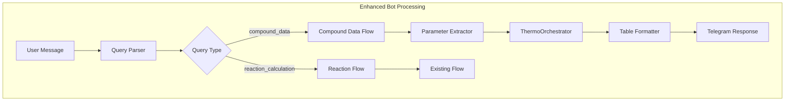
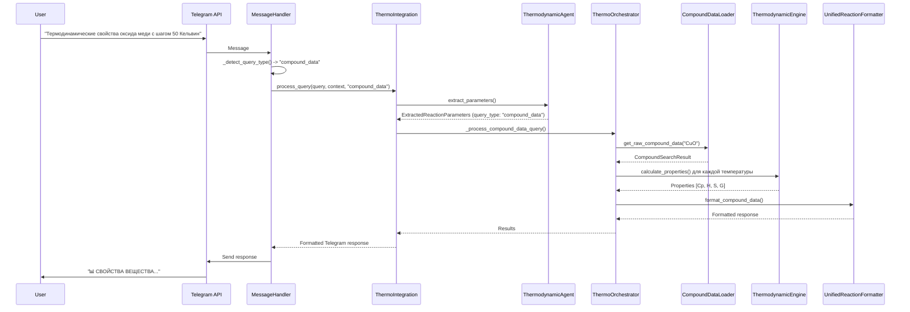
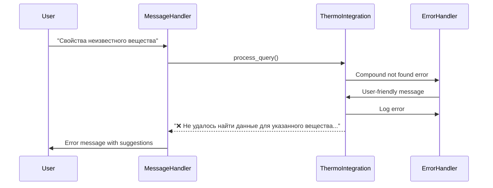

# Техническое задание: Имплементация функционала термодинамических свойств веществ

## Оглавление

- [Техническое задание: Имплементация функционала термодинамических свойств веществ](#техническое-задание-имплементация-функционала-термодинамических-свойств-веществ)
  - [Оглавление](#оглавление)
  - [Общее описание](#общее-описание)
    - [Цель проекта](#цель-проекта)
    - [Контекст](#контекст)
    - [Scope проекта](#scope-проекта)
  - [Архитектурное решение](#архитектурное-решение)
    - [Интеграция с существующей архитектурой](#интеграция-с-существующей-архитектурой)
      - [ThermoSystem Integration](#thermosystem-integration)
      - [Telegram Bot Architecture Integration](#telegram-bot-architecture-integration)
    - [Обновленная архитектура Telegram Bot](#обновленная-архитектура-telegram-bot)
  - [Требования к функционалу](#требования-к-функционалу)
    - [Функциональные требования](#функциональные-требования)
      - [FR-1: Распознавание типов запросов](#fr-1-распознавание-типов-запросов)
      - [FR-2: Извлечение параметров вещества](#fr-2-извлечение-параметров-вещества)
      - [FR-3: Расчет термодинамических свойств](#fr-3-расчет-термодинамических-свойств)
      - [FR-4: Форматирование результатов](#fr-4-форматирование-результатов)
      - [FR-5: Обработка ошибок](#fr-5-обработка-ошибок)
    - [Нефункциональные требования](#нефункциональные-требования)
      - [NFR-1: Производительность](#nfr-1-производительность)
      - [NFR-2: Надежность](#nfr-2-надежность)
      - [NFR-3: Совместимость](#nfr-3-совместимость)
  - [Детальная имплементация](#детальная-имплементация)
    - [Расширение модели ExtractedReactionParameters](#расширение-модели-extractedreactionparameters)
    - [Модификация ThermoOrchestrator](#модификация-thermoorchestrator)
    - [Обновление Telegram Bot обработчиков](#обновление-telegram-bot-обработчиков)
    - [Интеграция с форматтерами](#интеграция-с-форматтерами)
  - [Потоки выполнения](#потоки-выполнения)
    - [Основной поток обработки compound\_data](#основной-поток-обработки-compound_data)
    - [Обработка ошибок](#обработка-ошибок)
  - [Примеры кода](#примеры-кода)
    - [Ключевые методы и классы](#ключевые-методы-и-классы)
      - [1. Расширение ThermodynamicAgent](#1-расширение-thermodynamicagent)
      - [2. Оптимизация CompoundDataLoader](#2-оптимизация-compounddataloader)
      - [3. Telegram Bot ThermoIntegration](#3-telegram-bot-thermointegration)
    - [Примеры запросов и ответов](#примеры-запросов-и-ответов)
      - [Пример 1: Базовый запрос свойств вещества](#пример-1-базовый-запрос-свойств-вещества)
      - [Пример 2: Запрос с указанием фазы](#пример-2-запрос-с-указанием-фазы)
      - [Пример 3: Обработка ошибки](#пример-3-обработка-ошибки)
  - [Тестирование](#тестирование)
    - [Модульные тесты](#модульные-тесты)
      - [Тестирование ExtractedReactionParameters](#тестирование-extractedreactionparameters)
      - [Тестирование ThermoOrchestrator](#тестирование-thermoorchestrator)
    - [Интеграционные тесты](#интеграционные-тесты)
      - [Тестирование полной интеграции](#тестирование-полной-интеграции)
    - [Тесты Telegram Bot](#тесты-telegram-bot)
      - [Тестирование MessageHandler](#тестирование-messagehandler)
  - [Развертывание и валидация](#развертывание-и-валидация)
    - [Процесс развертывания](#процесс-развертывания)
      - [1. Подготовка окружения](#1-подготовка-окружения)
      - [2. Тестирование функционала](#2-тестирование-функционала)
      - [3. Валидация в development](#3-валидация-в-development)
    - [Валидация производительности](#валидация-производительности)
      - [Тесты нагрузки](#тесты-нагрузки)
  - [Критерии приемки](#критерии-приемки)
    - [Функциональные критерии](#функциональные-критерии)
    - [Технические критерии](#технические-критерии)
    - [Критерии качества](#критерии-качества)
    - [Валидационные тесты](#валидационные-тесты)
      - [Базовый функционал](#базовый-функционал)
      - [Обработка ошибок](#обработка-ошибок-1)
    - [Финальная валидация](#финальная-валидация)

---

## Общее описание

### Цель проекта

Реализовать функционал получения термодинамических свойств отдельных веществ в Telegram боте ThermoCalcBot. Функционал должен интегрироваться с существующей архитектурой ThermoSystem v2.2 и Telegram Bot Architecture, обеспечивая пользователям возможность запрашивать табличные данные термодинамических свойств (Cp, H, S, G) для конкретных веществ в заданных температурных диапазонах.

### Контекст

Текущая версия бота поддерживает только расчеты реакций (`reaction_calculation`). Запросы на свойства отдельных веществ (`compound_data`) возвращают сообщение "Обработка compound_data запросов будет добавлена позже". Необходимо реализовать полную поддержку этого типа запросов.

### Scope проекта

- Расширить ExtractedReactionParameters для поддержки `query_type: "compound_data"`
- Модифицировать ThermoOrchestrator для обработки запросов свойств веществ
- Обновить Telegram Bot обработчики для поддержки нового функционала
- Интегрировать с существующими форматтерами вывода
- Обеспечить корректную обработку ошибок и валидацию

---

## Архитектурное решение

### Интеграция с существующей архитектурой

#### ThermoSystem Integration

Основываясь на существующей архитектуре [ARCHITECTURE.md](../ARCHITECTURE.md), нам нужно расширить существующие компоненты для поддержки `compound_data` запросов:

```python
# src/thermo_agents/models/extraction.py - Расширение модели
class ExtractedReactionParameters(BaseModel):
    query_type: Literal["compound_data", "reaction_calculation"]

    # Для compound_data запросов
    compound: Optional[CompoundInfo] = None
    temperature_range_k: Optional[Tuple[float, float]] = None
    temperature_step_k: Optional[float] = None
    include_phases: Optional[List[str]] = None

    # Существующие поля для reaction_calculation
    balanced_equation: Optional[str] = None
    reactants: Optional[List[CompoundInfo]] = None
    products: Optional[List[CompoundInfo]] = None
```

#### Telegram Bot Architecture Integration

Основываясь на архитектуре [TELEGRAM_BOT_ARCHITECTURE.md](../TELEGRAM_BOT_ARCHITECTURE.md), нужно обновить следующие компоненты:

1. **MessageHandler** - Распознавание compound_data запросов
2. **ThermoIntegration** - Адаптация интерфейсов для нового типа запросов
3. **ResponseFormatter** - Форматирование табличных данных для Telegram
4. **SmartResponseHandler** - Оптимизация ответов с таблицами

### Обновленная архитектура Telegram Bot



---

## Требования к функционалу

### Функциональные требования

#### FR-1: Распознавание типов запросов
- Система должна автоматически определять тип запроса: compound_data или reaction_calculation
- Поддержка естественных формулировок запросов свойств веществ
- Валидация полноты параметров для compound_data запросов

#### FR-2: Извлечение параметров вещества
- Определение химической формулы вещества из запроса
- Извлечение температурного диапазона и шага
- Опциональное указание фаз (твердая, жидкая, газообразная)

#### FR-3: Расчет термодинамических свойств
- Расчет Cp(T), H(T), S(T), G(T) в заданном диапазоне температур
- Использование существующего ThermodynamicEngine
- Поддержка фазовых переходов

#### FR-4: Форматирование результатов
- Табличное представление данных для Telegram
- Поддержка Unicode химических формул
- Опциональные интерпретации результатов

#### FR-5: Обработка ошибок
- Информативные сообщения при отсутствии данных
- Fallback стратегии для неполных запросов
- Логирование ошибок для отладки

### Нефункциональные требования

#### NFR-1: Производительность
- Время ответа: < 5 секунд для типичных запросов
- Поддержка concurrency: 10+ одновременных пользователей
- Memory usage: < 200MB дополнительно

#### NFR-2: Надежность
- Graceful degradation при ошибках
- Валидация входных данных
- Обработка временных недоступностей ThermoSystem

#### NFR-3: Совместимость
- Полная обратная совместимость с существующим функционалом
- Соответствие существующим архитектурным паттернам
- Интеграция с текущей системой логирования

---

## Детальная имплементация

### Расширение модели ExtractedReactionParameters

```python
# src/thermo_agents/models/extraction.py
from typing import Optional, List, Tuple, Literal
from pydantic import BaseModel, Field, validator

class CompoundInfo(BaseModel):
    formula: str
    phase: Optional[str] = None
    stoichiometry: float = 1.0

class ExtractedReactionParameters(BaseModel):
    query_type: Literal["compound_data", "reaction_calculation"]

    # Общие поля
    temperature_range_k: Optional[Tuple[float, float]] = None
    temperature_step_k: Optional[float] = Field(default=50.0, ge=1.0, le=500.0)
    extraction_confidence: float = Field(ge=0.0, le=1.0)

    # Поля для compound_data
    compound: Optional[CompoundInfo] = None
    include_phases: Optional[List[str]] = Field(default=None, max_items=3)
    properties: Optional[List[str]] = Field(default=["Cp", "H", "S", "G"], max_items=4)

    # Поля для reaction_calculation (существующие)
    balanced_equation: Optional[str] = None
    reactants: Optional[List[CompoundInfo]] = None
    products: Optional[List[CompoundInfo]] = None

    @validator('compound')
    def validate_compound_for_compound_data(cls, v, values):
        if values.get('query_type') == 'compound_data' and not v:
            raise ValueError('Compound is required for compound_data queries')
        return v

    @validator('temperature_range_k')
    def validate_temperature_range(cls, v):
        if v and (v[0] < 0 or v[1] < v[0] or v[1] - v[0] > 2000):
            raise ValueError('Invalid temperature range')
        return v
```

### Модификация ThermoOrchestrator

```python
# src/thermo_agents/orchestrator.py - Ключевые изменения

class ThermoOrchestrator:
    async def process_query(self, query: str) -> str:
        """Основной метод обработки запросов с поддержкой compound_data"""
        try:
            # Извлечение параметров
            extracted_params = await self.thermodynamic_agent.extract_parameters(query)

            # Маршрутизация по типу запроса
            if extracted_params.query_type == "compound_data":
                return await self._process_compound_data_query(extracted_params)
            else:
                return await self._process_reaction_calculation(extracted_params)

        except Exception as e:
            return self._handle_error(e, extracted_params)

    async def _process_compound_data_query(self, params: ExtractedReactionParameters) -> str:
        """Обработка запросов свойств веществ"""
        try:
            # Валидация параметров
            self._validate_compound_data_params(params)

            # Поиск данных вещества
            compound_data = await self._load_compound_data(params.compound)

            # Расчет свойств
            results = await self._calculate_compound_properties(compound_data, params)

            # Форматирование результатов
            return await self.unified_formatter.format_compound_data(results, params)

        except Exception as e:
            return self._handle_compound_data_error(e, params)

    async def _load_compound_data(self, compound: CompoundInfo) -> CompoundSearchResult:
        """Загрузка данных вещества с использованием существующей инфраструктуры"""
        # Используем существующий CompoundDataLoader
        data_loader = CompoundDataLoader(
            db_connector=self.db_connector,
            static_data_manager=self.static_data_manager
        )

        return await data_loader.get_raw_compound_data(
            formula=compound.formula,
            phase=compound.phase
        )

    async def _calculate_compound_properties(
        self,
        compound_data: CompoundSearchResult,
        params: ExtractedReactionParameters
    ) -> Dict[str, Any]:
        """Расчет термодинамических свойств"""
        t_min, t_max = params.temperature_range_k
        step = params.temperature_step_k

        # Используем существующий ThermodynamicEngine
        results = []
        for temp in range(int(t_min), int(t_max) + 1, int(step)):
            properties = await self.thermodynamic_engine.calculate_properties(
                compound_data=compound_data,
                temperature=temp
            )
            results.append({
                'temperature': temp,
                'cp': properties.cp,
                'h': properties.h,
                's': properties.s,
                'g': properties.g,
                'phase': properties.phase
            })

        return {
            'compound': params.compound,
            'temperature_range': params.temperature_range_k,
            'step': params.temperature_step_k,
            'properties': params.properties,
            'results': results
        }
```

### Обновление Telegram Bot обработчиков

```python
# src/thermo_agents/telegram_bot/handlers/message_handler.py

class MessageHandler:
    async def handle_message(self, message: Message, session: UserSession) -> str:
        """Обработка сообщений с поддержкой compound_data"""
        try:
            # Предварительная обработка
            processed_query = self._preprocess_query(message.text)

            # Определение типа запроса
            query_type = self._detect_query_type(processed_query)

            # Логирование
            session.logger.info(f"Processing {query_type} query: {processed_query}")

            # Передача в ThermoIntegration
            response = await self.thermo_integration.process_query(
                query=processed_query,
                session_context=session.context,
                query_type=query_type
            )

            return response

        except Exception as e:
            return await self.error_handler.handle_message_error(e, message, session)

    def _detect_query_type(self, query: str) -> str:
        """Определение типа запроса по ключевым словам"""
        compound_keywords = [
            'свойства', 'характеристики', 'термодинамические данные',
            'табличные данные', 'свойства вещества', 'данные для',
            'температурная зависимость'
        ]

        reaction_keywords = [
            'реакция', '→', '->', '+', 'реагирует', 'продукты',
            'уравнение', 'стехиометрия'
        ]

        query_lower = query.lower()

        if any(keyword in query_lower for keyword in compound_keywords):
            return "compound_data"
        elif any(keyword in query_lower for keyword in reaction_keywords):
            return "reaction_calculation"
        else:
            return "auto"  # Позволить LLM определить тип
```

### Интеграция с форматтерами

```python
# src/thermo_agents/formatting/unified_reaction_formatter.py - Расширение

class UnifiedReactionFormatter:
    async def format_compound_data(
        self,
        results: Dict[str, Any],
        params: ExtractedReactionParameters
    ) -> str:
        """Форматирование результатов для compound_data запросов"""

        # Форматирование информации о веществе
        compound_info = self.compound_info_formatter.format_compound_info(
            results['compound']
        )

        # Форматирование таблицы свойств
        properties_table = self.table_formatter.format_compound_properties_table(
            results['results'],
            properties=params.properties
        )

        # Форматирование интерпретации
        interpretation = self.interpretation_formatter.format_compound_interpretation(
            results
        )

        # Компоновка итогового ответа
        response = f"📊 *СВОЙСТВА ВЕЩЕСТВА*\n\n"
        response += f"{compound_info}\n\n"
        response += f"{properties_table}\n\n"

        if interpretation:
            response += f"💡 *Анализ*\n{interpretation}"

        return response
```

---

## Потоки выполнения

### Основной поток обработки compound_data



### Обработка ошибок



---

## Примеры кода

### Ключевые методы и классы

#### 1. Расширение ThermodynamicAgent

```python
# src/thermo_agents/thermodynamic_agent.py - Ключевой метод извлечения

class ThermodynamicAgent:
    async def extract_parameters(self, query: str) -> ExtractedReactionParameters:
        """Извлечение параметров с поддержкой compound_data"""

        prompt = self._build_extraction_prompt(query)

        result = await self.llm_client.run(
            agent=self.agent,
            message=prompt
        )

        # Валидация и постобработка
        params = result.data

        # Дополнительная обработка для compound_data
        if params.query_type == "compound_data":
            params = await self._enhance_compound_data_params(params, query)

        return params

    def _build_extraction_prompt(self, query: str) -> str:
        """Построение промпта для извлечения параметров"""
        return f"""
        Проанализируй запрос и извлеки параметры:

        Запрос: "{query}"

        Определи тип запроса:
        - "compound_data": если запрашиваются свойства одного вещества
        - "reaction_calculation": если запрашивается расчет реакции

        Для compound_data извлеки:
        - Химическая формула вещества
        - Температурный диапазон (если указан)
        - Шаг температуры (по умолчанию 50K)
        - Фазы (если указаны)

        {self._get_extraction_examples()}
        """
```

#### 2. Оптимизация CompoundDataLoader

```python
# src/thermo_agents/core_logic/compound_data_loader.py - Оптимизация

class CompoundDataLoader:
    async def get_raw_compound_data(
        self,
        formula: str,
        phase: Optional[str] = None
    ) -> CompoundSearchResult:
        """Оптимизированная загрузка данных вещества"""

        # Шаг 1: Проверка StaticDataManager (YAML кэш)
        if self.static_data_manager.has_compound(formula):
            cached_data = self.static_data_manager.get_compound_data(formula)
            if self._validate_cached_data(cached_data, phase):
                return self._convert_to_search_result(cached_data)

        # Шаг 2: Поиск в базе данных
        search_result = await self._search_database(formula, phase)

        if not search_result.records:
            raise CompoundNotFoundError(f"Data not found for {formula}")

        return search_result

    async def _search_database(self, formula: str, phase: Optional[str]) -> CompoundSearchResult:
        """Поиск в базе данных с fallback стратегиями"""

        # Стратегия 1: Точный поиск
        exact_result = await self.compound_searcher.search_compound(
            formula=formula,
            phase=phase,
            exact_match=True
        )

        if exact_result.records:
            return exact_result

        # Стратегия 2: Расширенный поиск
        broad_result = await self.compound_searcher.search_compound(
            formula=formula,
            phase=phase,
            exact_match=False
        )

        return broad_result
```

#### 3. Telegram Bot ThermoIntegration

```python
# src/thermo_agents/telegram_bot/utils/thermo_integration.py

class ThermoIntegration:
    def __init__(self, orchestrator: ThermoOrchestrator):
        self.orchestrator = orchestrator
        self.response_formatter = ResponseFormatter()

    async def process_query(
        self,
        query: str,
        session_context: Dict[str, Any],
        query_type: Optional[str] = None
    ) -> str:
        """Основной метод интеграции с ThermoSystem"""

        try:
            # Предобработка запроса
            enhanced_query = self._enhance_query(query, session_context)

            # Если тип определен, добавляем в запрос
            if query_type:
                enhanced_query = f"[TYPE:{query_type}] {enhanced_query}"

            # Выполнение расчета
            result = await self.orchestrator.process_query(enhanced_query)

            # Постобработка для Telegram
            return self.response_formatter.format_for_telegram(result)

        except Exception as e:
            return self._handle_integration_error(e, query, session_context)

    def _enhance_query(self, query: str, context: Dict[str, Any]) -> str:
        """Enhancement запроса на основе контекста сессии"""

        # Добавление предыдущего контекста если необходимо
        if context.get('previous_compound'):
            query += f" (предыдущий запрос: {context['previous_compound']})"

        # Коррекция температурных диапазонов
        if not any(temp_indicator in query.lower() for temp_indicator in ['k', '°c', 'celsius']):
            default_range = "298-1000K"
            query += f" в диапазоне {default_range}"

        return query
```

### Примеры запросов и ответов

#### Пример 1: Базовый запрос свойств вещества

**Запрос пользователя:**
```
"Термодинамические свойства оксида меди с шагом 50 Кельвин"
```

**ExtractedReactionParameters:**
```python
ExtractedReactionParameters(
    query_type="compound_data",
    compound=CompoundInfo(formula="CuO", phase=None),
    temperature_range_k=(298, 1000),
    temperature_step_k=50.0,
    properties=["Cp", "H", "S", "G"],
    extraction_confidence=0.95
)
```

**Ответ бота:**
```
📊 *СВОЙСТВА ВЕЩЕСТВА*

**CuO (оксид меди)**
- Фаза: Твердая
- Стандартная энтальпия H₂₉₈: -155.2 кДж/моль
- Стандартная энтропия S₂₉₈: 42.6 Дж/(моль·K)
- Температурный диапазон: 298-1000K, шаг 50K

┌──────┬──────────┬──────────┬─────────┬──────────┐
│  T,K │    Cp    │     H    │    S    │     G    │
├──────┼──────────┼──────────┼─────────┼──────────┤
│  298 │   42.38  │ -155.20  │  42.59  │ -168.88  │
│  348 │   44.12  │ -153.03  │  44.12  │ -169.43  │
│  398 │   45.67  │ -150.79  │  45.46  │ -169.89  │
│  448 │   47.06  │ -148.49  │  46.66  │ -170.28  │
│  498 │   48.31  │ -146.13  │  47.73  │ -170.60  │
└──────┴──────────┴──────────┴─────────┴──────────┘

💡 *Анализ*
- Cp увеличивается с температурой (типично для твердых веществ)
- Энергия Гиббса G становится менее отрицательной, стабильность уменьшается
- Энтропия S монотонно возрастает с температурой
```

#### Пример 2: Запрос с указанием фазы

**Запрос пользователя:**
```
"Свойства воды H2O жидкая фаза от 300 до 350K"
```

**Обработка:**
```python
# Автоматическое определение query_type и параметров
params = ExtractedReactionParameters(
    query_type="compound_data",
    compound=CompoundInfo(formula="H2O", phase="l"),
    temperature_range_k=(300, 350),
    temperature_step_k=50.0,
    properties=["Cp", "H", "S", "G"]
)
```

#### Пример 3: Обработка ошибки

**Запрос пользователя:**
```
"Свойства несуществующего вещества XyZ"
```

**Ответ бота:**
```
❌ *Не удалось найти данные*

Для вещества "XyZ" не найдены термодинамические данные.

Возможные причины:
- Опечатка в химической формуле
- Вещество отсутствует в базе данных
- Неподдерживаемое соединение

💡 *Рекомендации*
- Проверьте правильность написания формулы
- Попробуйте указать фазу (твердая, жидкая, газообразная)
- Используйте распространенные вещества: H2O, CO2, Fe2O3, CuO

_Сгенерировано ThermoSystem Telegram Bot_
```

---

## Тестирование

### Модульные тесты

#### Тестирование ExtractedReactionParameters

```python
# tests/unit/test_compound_data_extraction.py

import pytest
from thermo_agents.models.extraction import ExtractedReactionParameters, CompoundInfo

class TestCompoundDataExtraction:
    @pytest.mark.asyncio
    async def test_extract_compound_data_basic(self):
        """Тест базового извлечения параметров compound_data"""

        query = "Термодинамические свойства оксида меди с шагом 50 Кельвин"

        params = await self.agent.extract_parameters(query)

        assert params.query_type == "compound_data"
        assert params.compound.formula == "CuO"
        assert params.temperature_step_k == 50.0
        assert params.properties == ["Cp", "H", "S", "G"]

    @pytest.mark.asyncio
    async def test_extract_with_temperature_range(self):
        """Тест извлечения с температурным диапазоном"""

        query = "Свойства H2O от 300 до 600K с шагом 25"

        params = await self.agent.extract_parameters(query)

        assert params.compound.formula == "H2O"
        assert params.temperature_range_k == (300, 600)
        assert params.temperature_step_k == 25.0

    def test_validation_compound_required(self):
        """Тест валидации - обязательное поле compound"""

        with pytest.raises(ValueError, match="Compound is required"):
            ExtractedReactionParameters(
                query_type="compound_data",
                compound=None
            )

    def test_validation_temperature_range(self):
        """Тест валидации температурного диапазона"""

        with pytest.raises(ValueError, match="Invalid temperature range"):
            ExtractedReactionParameters(
                query_type="compound_data",
                compound=CompoundInfo(formula="H2O"),
                temperature_range_k=(-100, 300)  # Некорректный диапазон
            )
```

#### Тестирование ThermoOrchestrator

```python
# tests/unit/test_compound_data_orchestrator.py

class TestCompoundDataOrchestrator:
    @pytest.mark.asyncio
    async def test_process_compound_data_success(self):
        """Тест успешной обработки compound_data запроса"""

        params = ExtractedReactionParameters(
            query_type="compound_data",
            compound=CompoundInfo(formula="H2O"),
            temperature_range_k=(298, 400),
            temperature_step_k=50.0
        )

        result = await self.orchestrator._process_compound_data_query(params)

        assert "H2O" in result
        assert "Cp" in result or "температура" in result.lower()
        assert "таблица" in result.lower() or "┌" in result

    @pytest.mark.asyncio
    async def test_process_compound_data_not_found(self):
        """Тест обработки отсутствия данных"""

        params = ExtractedReactionParameters(
            query_type="compound_data",
            compound=CompoundInfo(formula="NonExistentCompound"),
            temperature_range_k=(298, 400)
        )

        result = await self.orchestrator._process_compound_data_query(params)

        assert "не найдены" in result.lower() or "не удалось" in result.lower()
```

### Интеграционные тесты

#### Тестирование полной интеграции

```python
# tests/integration/test_compound_data_integration.py

class TestCompoundDataIntegration:
    @pytest.mark.asyncio
    async def test_end_to_end_compound_data(self):
        """Полный цикл обработки compound_data запроса"""

        # Создание полного стека
        config = ThermoOrchestratorConfig(
            llm_api_key="test_key",
            db_path=Path("test_data.db")
        )

        orchestrator = ThermoOrchestrator(config)

        # Выполнение запроса
        query = "Термодинамические свойства CuO с шагом 50K"
        response = await orchestrator.process_query(query)

        # Проверки
        assert "CuO" in response
        assert "свойства" in response.lower()
        assert len(response) > 100  # Существенный ответ

    @pytest.mark.asyncio
    async def test_compound_vs_reaction_distinction(self):
        """Тест различения типов запросов"""

        # Compound data запрос
        compound_query = "Свойства воды"
        compound_response = await self.orchestrator.process_query(compound_query)

        # Reaction запрос
        reaction_query = "2 H2 + O2 → 2 H2O"
        reaction_response = await self.orchestrator.process_query(reaction_query)

        # Проверка, что ответы разные по типу
        assert compound_response != reaction_response
        assert "свойства" in compound_response.lower()
        assert "реакция" in reaction_response.lower() or "ΔH" in reaction_response
```

### Тесты Telegram Bot

#### Тестирование MessageHandler

```python
# tests/telegram_bot/test_message_handler_compound.py

class TestMessageHandlerCompound:
    @pytest.mark.asyncio
    async def test_compound_data_message_handling(self):
        """Тест обработки compound_data сообщений"""

        message = Mock()
        message.text = "Термодинамические свойства оксида меди"
        message.chat_id = 12345

        session = Mock()
        session.context = {}
        session.logger = Mock()

        response = await self.message_handler.handle_message(message, session)

        assert "CuO" in response or "оксида меди" in response.lower()
        assert "свойства" in response.lower()

    def test_detect_query_type_compound(self):
        """Тест определения типа compound_data запроса"""

        compound_queries = [
            "Свойства вещества",
            "Термодинамические данные для H2O",
            "Температурная зависимость Cp",
            "Характеристики оксида железа"
        ]

        for query in compound_queries:
            query_type = self.message_handler._detect_query_type(query)
            assert query_type == "compound_data"

    def test_detect_query_type_reaction(self):
        """Тест определения типа reaction_calculation запроса"""

        reaction_queries = [
            "2 H2 + O2 → 2 H2O",
            "Реакция горения метана",
            "Fe + O2 = Fe2O3",
            "Продукты реакции алюминия с кислородом"
        ]

        for query in reaction_queries:
            query_type = self.message_handler._detect_query_type(query)
            assert query_type == "reaction_calculation"
```

---

## Развертывание и валидация

### Процесс развертывания

#### 1. Подготовка окружения

```bash
# 1. Резервное копирование
cp -r src/thermo_agents src/thermo_agents.backup

# 2. Синхронизация зависимостей
uv sync

# 3. Проверка базы данных
uv run python -c "
import sqlite3
conn = sqlite3.connect('data/thermo_data.db')
cursor = conn.cursor()
cursor.execute('SELECT COUNT(*) FROM thermodynamic_data')
print(f'Records in DB: {cursor.fetchone()[0]}')
conn.close()
"
```

#### 2. Тестирование функционала

```bash
# Запуск тестов для compound_data
uv run pytest tests/unit/test_compound_data_*.py -v
uv run pytest tests/integration/test_compound_data_integration.py -v

# Запуск тестов Telegram Bot
uv run pytest tests/telegram_bot/test_message_handler_compound.py -v

# Полный тестовый набор
uv run pytest tests/ -k "compound_data" -v
```

#### 3. Валидация в development

```bash
# Запуск в тестовом режиме
uv run python main.py --test

# Примеры запросов для валидации
echo "Термодинамические свойства оксида меди с шагом 50 Кельвин" | uv run python main.py --stdin
echo "Свойства воды H2O от 300 до 400K" | uv run python main.py --stdin
echo "Характеристики CO2 газообразная фаза" | uv run python main.py --stdin
```

### Валидация производительности

#### Тесты нагрузки

```python
# tests/performance/test_compound_data_performance.py

class TestCompoundDataPerformance:
    @pytest.mark.asyncio
    async def test_response_time_compound_data(self):
        """Тест времени ответа для compound_data запросов"""

        start_time = time.time()

        query = "Термодинамические свойства CuO"
        response = await self.orchestrator.process_query(query)

        end_time = time.time()
        response_time = end_time - start_time

        # Проверка требований к производительности
        assert response_time < 5.0, f"Response time {response_time}s > 5s"
        assert len(response) > 50, "Response too short"

    @pytest.mark.asyncio
    async def test_concurrent_compound_requests(self):
        """Тест concurrent запросов свойств веществ"""

        queries = [
            "Свойства H2O",
            "Свойства CO2",
            "Свойства Fe2O3",
            "Свойства CuO",
            "Свойства NH3"
        ]

        start_time = time.time()

        # Concurrent выполнение
        tasks = [
            self.orchestrator.process_query(query)
            for query in queries
        ]
        responses = await asyncio.gather(*tasks)

        end_time = time.time()
        total_time = end_time - start_time

        # Проверки
        assert len(responses) == len(queries)
        assert total_time < 15.0, f"Concurrent processing took {total_time}s"

        for response in responses:
            assert len(response) > 100
```

---

## Критерии приемки

### Функциональные критерии

- [ ] **FC-1**: Система корректно определяет `compound_data` тип запроса для различных формулировок
- [ ] **FC-2**: LLM агент извлекает параметры вещества с точностью > 90%
- [ ] **FC-3**: ThermoOrchestrator обрабатывает compound_data запросы без ошибок
- [ ] **FC-4**: Telegram Bot возвращает корректные табличные данные для веществ
- [ ] **FC-5**: Форматирование ответов соответствует требованиям Telegram

### Технические критерии

- [ ] **TC-1**: Время ответа для типичных compound_data запросов < 5 секунд
- [ ] **TC-2**: Система обрабатывает 10+ concurrent compound_data запросов
- [ ] **TC-3**: Memory usage увеличивается не более чем на 200MB
- [ ] **TC-4**: Обратная совместимость с reaction_calculation функционалом сохранена
- [ ] **TC-5**: Все тесты проходят успешно (unit, integration, e2e)

### Критерии качества

- [ ] **QC-1**: Code coverage > 85% для нового функционала
- [ ] **QC-2**: Документация обновлена для всех измененных компонентов
- [ ] **QC-3**: Логирование позволяет отслеживать все этапы обработки
- [ ] **QC-4**: Обработка ошибок предоставляет информативные сообщения
- [ ] **QC-5**: Система устойчива к некорректным входным данным

### Валидационные тесты

#### Базовый функционал
```bash
# Тестовые запросы для валидации
test_queries = [
    "Термодинамические свойства оксида меди с шагом 50 Кельвин",
    "Свойства воды H2O от 300 до 600K",
    "Характеристики CO2 газообразная фаза",
    "Температурная зависимость Cp для Fe2O3",
    "Данные для CuO жидкая фаза"
]

for query in test_queries:
    response = await bot.process_query(query)
    assert "свойства" in response.lower()
    assert len(response) > 200
```

#### Обработка ошибок
```bash
# Тестовые запросы с ошибками
error_queries = [
    "Свойства несуществующего вещества",
    "Некорректный запрос",
    "",
    "12345"
]

for query in error_queries:
    response = await bot.process_query(query)
    assert "ошибка" in response.lower() or "не удалось" in response.lower()
```

### Финальная валидация

После успешного выполнения всех тестов и критериев:

1. **Деплой на тестовый сервер**
2. **Нагрузочное тестирование в течение 24 часов**
3. **Валидация реальными пользователями (beta testing)**
4. **Финальный деплой на production**

---

**Дата создания:** 11 ноября 2025
**Версия документа:** 1.0
**Статус:** Technical Specification
**Ответственный:** Development Team

*Документ является основой для имплементации функционала термодинамических свойств веществ в ThermoCalcBot Telegram Bot.*