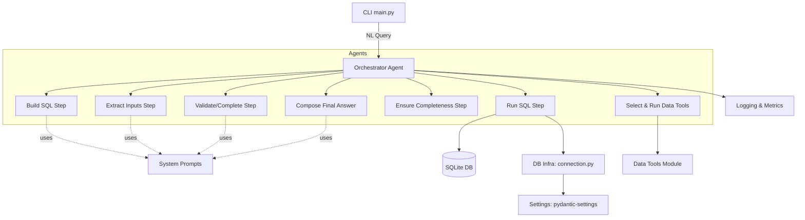
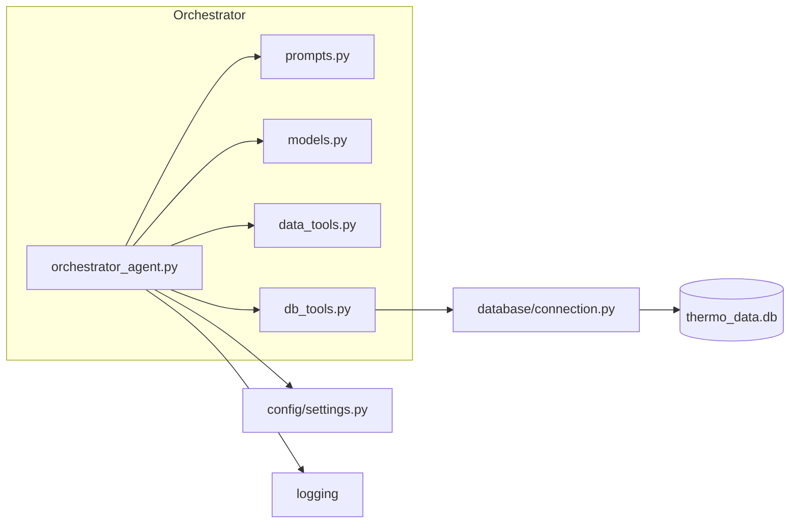
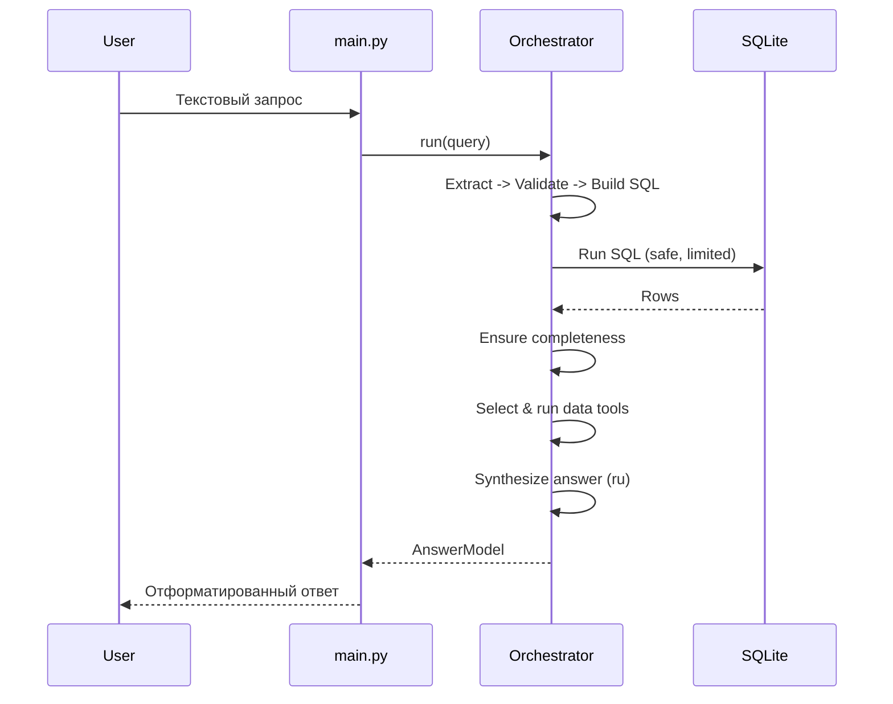

# Техническое задание: Оркестратор‑агент на Pydantic AI (конкретизировано)

Дата: 2025-09-11
Версия: 1.1
Статус: Draft (к утверждению)
Ответственные: Архитектор — TBD; Разработчик — TBD; Тестирование — TBD

## 0. Резюме

Нужен оркестратор‑агент (Pydantic AI), который по текстовому запросу:
1) извлекает параметры; 2) валидирует/дополняет; 3) генерирует SQL; 4) безопасно исполняет; 5) проверяет полноту; 6) при необходимости применяет Python‑инструменты для пост‑обработки; 7) формирует итоговый ответ на русском. Каждый LLM‑шаг имеет свой промпт и модель. Реализация поэтапная, с тестами и логами.

## 1. Контекст и цели

- Контекст: проект agents_for_david — генерация SQL по NL к термодинамической БД (SQLite). Уже есть SQL‑агент.
- Цель: добавить самостоятельный оркестратор‑агент, завернув шаги в единый управляемый поток с безопасностью, метриками и тестами.
- KPI: время ответа ≤ 6 c при типичных запросах; 100% unit тестов новых модулей; e2e «happy path» проходит; SQL валидатор корректно отлавливает ошибки и инициирует повторную генерацию.

## 2. Архитектура (как если бы проектировалось с нуля)

### 2.1 Слоистая схема

Ключевые границы:
- Представление: `main.py` (CLI)
- Оркестратор и шаги: `app/agents/`
- Инструменты: `app/agents/tools/`
- БД слой: `app/database/`
- Конфигурация: `app/config/`

### 2.2 Компонентная диаграмма

### 2.3 Последовательность выполнения (7 шагов)

## 3. Область работ и границы

Включено:
- Новый модуль оркестратора и шагов на Pydantic AI
- Перенос двух Python‑инструментов из ноутбуков (без графиков)
- Инструменты БД: безопасный SQL, EXPLAIN, таймауты, лимиты
- Промпты для шагов, контракты Pydantic, usage limits, логи, тесты

Не включено:
- LangGraph/чекпоинты, UI/веб

## 4. Детализированные требования по шагам

1) Extract inputs
- Вход: user_text: str
- Выход: ExtractedParams
- Правила: строгая схема; при неполноте — ModelRetry с перечислением недостающих полей; не придумывать факты

2) Validate or complete
- Вход/выход: ExtractedParams
- Правила: диапазоны T, допустимые фазы (s,l,g,aq), корректные фильтры; при противоречиях — ModelRetry с инструкцией

3) Build SQL
- Вход: ExtractedParams
- Выход: SqlCandidate
- Правила: использовать sql_prompt; OutputValidator выполняет EXPLAIN и запрещает DDL/DML; авто‑LIMIT

4) Run SQL
- Вход: sql: str
- Выход: Rows
- Правила: только SELECT/EXPLAIN; таймаут; LIMIT из настроек; измерение времени

5) Ensure completeness
- Вход: Rows, NeedSpec
- Выход: CompletenessResult
- Правила: колонки/минимум строк/ненулевые поля; при fail — возврат к Build SQL с подсказками

6) Select data tools
- Вход: user_text, Rows
- Выход: list[ToolSpec] + ToolRunResult[]
- Правила: белый список инструментов и простая стратегия выбора (keywords/инструкции)

7) Synthesize answer
- Вход: Rows, ToolRunResult[], Meta
- Выход: AnswerModel | str
- Правила: краткий структурированный ответ на русском; уважать max_tokens; помечать усечение по LIMIT

## 5. Контракты данных (Pydantic)

Новые в `app/agents/models.py`:
- ExtractedParams
  - raw_query: str
  - intent: Literal["fetch","aggregate","thermo_calc","mixed","unknown"]
  - entities: list[str]
  - phases: list[str] | None
  - columns: list[str] | None
  - filters: dict[str, Any] | None
  - limits: int | None
  - need_spec: NeedSpec | None
- NeedSpec
  - required_columns: list[str] | None
  - min_rows: int | None
  - require_non_null: list[str] | None
- SqlCandidate: { sql: str, rationale: str }
- Rows: { columns: list[str], rows: list[dict[str, Any]], execution_time: float, total_records: int }
- CompletenessResult: { ok: bool, missing_columns?: list[str], missing_rows?: int, hints?: str }
- ToolSpec: { name: Literal["thermodynamic_table","reaction_H_S_G_wc"], args: dict[str, Any] }
- ToolRunResult: { tool: str, output: dict[str, Any] | str, warnings?: list[str] }
- AnswerModel: { text: str, data_preview?: Rows, tool_results?: list[ToolRunResult], meta?: dict[str, Any] }

Примечания:
- Строгая валидация входа/выхода на каждом шаге (Pydantic)

## 6. Промпты и модели

- prompts.py: добавить
  - extract_inputs_prompt
  - validate_or_complete_prompt
  - synthesize_answer_prompt
  - sql_prompt — переиспользовать текущую основу
- Модели через OpenRouter (пер‑шаговые в settings):
  - MODEL_NAME_EXTRACT (темп 0.2–0.4)
  - MODEL_NAME_VALIDATE (0.2–0.4)
  - MODEL_NAME_SQL (0–0.2)
  - MODEL_NAME_ANSWER (0.3–0.5)
- Таймауты: LLM_TIMEOUT_S по шагам; retries с экспоненциальной задержкой

## 7. Инструменты

- app/agents/tools/data_tools.py
  - thermodynamic_table(row_like: Mapping[str, Any]) -> list[dict]
  - reaction_H_S_G_wc(T_K: float, rows_bundle: dict[str, Mapping[str, Any]]) -> dict
  - Требования: без побочных эффектов; проверка диапазонов; единицы измерения документированы
- app/agents/tools/db_tools.py
  - run_sql(sql: str, limit: int | None) -> Rows
  - explain_sql(sql: str) -> dict
  - sanitize/limit_sql(sql: str, default_limit: int) -> str
  - Только SELECT/EXPLAIN, защита от DDL/DML; использовать `app/database/connection.py`

## 8. Конфигурация (settings.py)

Добавить/уточнить:
- MODEL_NAME_EXTRACT, MODEL_NAME_VALIDATE, MODEL_NAME_SQL, MODEL_NAME_ANSWER (optional overrides)
- LLM_TIMEOUT_S, DB_TIMEOUT_S
- USAGE_LIMITS: max_tool_calls, max_model_calls per run
- MAX_QUERY_RESULTS — применять в limit_sql
- .env.example — безопасные дефолты

## 9. Логи и метрики

- Структурированные логи: выбранные модели, длительности шагов, токены, строки БД
- Ошибки: человеко‑читаемые сообщения и рекомендации

## 10. Тестирование

- unit: extract, validate, sql validator, db_tools, data_tools
- e2e: happy path; неполнота → возврат на Build SQL; большой результат → LIMIT
- Запуск: `uv run pytest`
- Mock LLM для детерминированности; smoke с реальным провайдером — под флагом

## 11. План работ (итерации, конкретные задачи)

Итерация 1 — Инфраструктура (2–3 дня)
- Создать `app/agents/models.py` с контрактами
- Реализовать `app/agents/tools/db_tools.py`: sanitize, limit, explain, run_sql, анти‑DDL/DML
- Перенести `data_tools.py` (без графиков) с тестами на известные случаи
- Дополнить `settings.py`: MAX_QUERY_RESULTS уже есть; добавить таймауты и usage limits (без фактической интеграции)
- Тесты unit: db_tools, data_tools (happy + 1–2 edge)

Итерация 2 — LLM шаги (3–4 дня)
- Добавить промпты: extract, validate, synthesize в `prompts.py`
- Реализовать `orchestrator_agent.py` c шагами: extract → validate → build_sql (с EXPLAIN‑валидатором) → run_sql
- Настроить модели/температуры/таймауты per‑step
- Unit тесты: валидатор SQL (EXPLAIN → ModelRetry), маршрутизация prepare_tools (whitelist)

Итерация 3 — Полнота и пост‑обработка (2–3 дня)
- Реализовать ensure_completeness и возврат к build_sql при fail
- Реализовать select_data_tools (whitelist, simple strategy) и выполнение инструментов
- Реализовать synthesize_answer (ru, с пометкой LIMIT)
- e2e: happy path + 1–2 негативных

Итерация 4 — Полировка (1–2 дня)
- Логи/метрики, usage limits, документация (.env.example, README)
- Финальный проход тестов; стабилизация

## 12. Риски и смягчение

- Перенос формул/единиц: покрыть тестами и сверить с ноутбуками
- Затраты LLM: usage limits + дешёвые модели на ранних шагах
- Медленные запросы к БД: таймауты, LIMIT, при необходимости индексы

## 13. Критерии приёмки

- Полный прогон 7 шагов в одном запуске с ограничением инструментов per‑step
- Валидатор SQL корректно инициирует повтор и генерируется валидный запрос
- Инструменты из ноутбуков перенесены и работают на тестах
- Ответ на русском, структурирован, с пометкой об усечении при LIMIT
- Все тесты проходят локально (`uv run pytest`), текущий функционал не сломан

## 14. Миграция и откат

- Миграция: добавить новые файлы модулей; интегрировать вызов оркестратора в `main.py` за флагом
- Откат: отключить вызов оркестратора; оставить инструменты как утилиты

## 15. Приложение: контракты интерфейсов (мини‑спецификация)

- Оркестратор: `run(user_text: str) -> AnswerModel`
- db_tools:
  - `sanitize_sql(sql) -> str | raises ValueError`
  - `limit_sql(sql, default_limit) -> str`
  - `explain_sql(sql) -> dict | raises DBError`
  - `run_sql(sql, limit=None) -> Rows | raises TimeoutError, DBError`
- data_tools:
  - `thermodynamic_table(row) -> list[dict] | raises ValueError`
  - `reaction_H_S_G_wc(T_K, rows_bundle) -> dict | raises ValueError`
