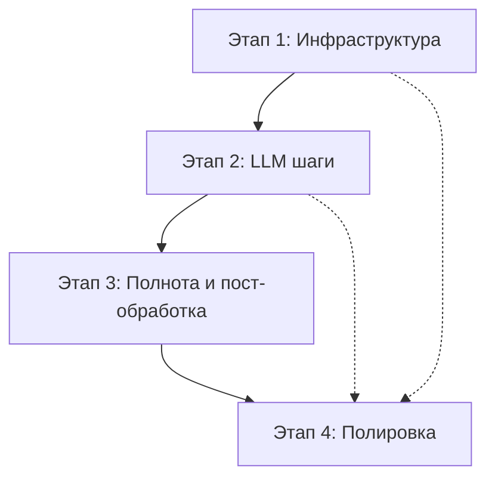

# Общий план разработки оркестратора-агента

**Версия:** 1.1  
**Дата создания:** 2025-01-11  
**Статус:** Готов к реализации

## Краткое описание

Разработка оркестратора-агента на Pydantic AI для обработки текстовых запросов к термодинамической БД через 7-шаговый workflow: извлечение параметров → валидация → генерация SQL → выполнение → проверка полноты → пост-обработка → синтез ответа.

## Структура этапов

### [Этап 1: Инфраструктура](./этап_1_инфраструктура.md) (2-3 дня)
**Статус:** Планируется  
**Цель:** Создание базовой инфраструктуры

**Ключевые задачи:**
- Модели данных (`app/agents/models.py`)
- Инструменты работы с БД (`app/agents/tools/db_tools.py`) 
- Инструменты обработки данных (`app/agents/tools/data_tools.py`)
- Обновление конфигурации (`app/config/settings.py`)
- Unit тесты для базовых модулей

**Критерии готовности:** ✅ Все модули протестированы и готовы к интеграции

---

### [Этап 2: LLM шаги](./этап_2_llm_шаги.md) (3-4 дня)  
**Статус:** Планируется  
**Цель:** Реализация основных LLM-шагов оркестратора

**Ключевые задачи:**
- Промпты для новых шагов (`docs/tech_specs/prompts.py`)
- Оркестратор с шагами 1-4 (`app/agents/orchestrator_agent.py`)
- SQL валидатор с EXPLAIN (`app/agents/tools/sql_validator.py`)
- Настройка моделей и температур
- Unit тесты с мокированием LLM

**Критерии готовности:** ✅ Первые 4 шага workflow работают стабильно

---

### [Этап 3: Полнота и пост-обработка](./этап_3_полнота_и_постобработка.md) (2-3 дня)
**Статус:** Планируется  
**Цель:** Завершение workflow и интеграция

**Ключевые задачи:**
- Проверка полноты данных (шаг 5)
- Выбор и выполнение инструментов (шаг 6)  
- Синтез итогового ответа (шаг 7)
- Интеграция в `main.py`
- E2E тесты полного цикла

**Критерии готовности:** ✅ Полный цикл из 7 шагов выполняется корректно

---

### [Этап 4: Полировка](./этап_4_полировка.md) (1-2 дня)
**Статус:** Планируется  
**Цель:** Финализация и документация

**Ключевые задачи:**
- Логирование и метрики (`app/utils/logging.py`)
- Usage limits (`app/utils/usage_tracker.py`)
- Comprehensive документация
- Обновление `.env.example`
- Performance оптимизация
- Финальная стабилизация тестов

**Критерии готовности:** ✅ Продукт готов к production использованию

## Общие принципы разработки

### Архитектурные принципы
- **Модульность:** каждый шаг как отдельная функция
- **Безопасность:** защита от SQL injection, usage limits
- **Наблюдаемость:** структурированные логи и метрики
- **Тестируемость:** высокое покрытие тестами, мокирование LLM
- **Конфигурируемость:** настройка через environment variables

### Качество кода
- **Типизация:** полная типизация с mypy
- **Документация:** docstrings для всех публичных методов
- **Валидация:** Pydantic модели для всех контрактов
- **Ошибки:** graceful degradation и понятные сообщения

### Performance требования
- **Время ответа:** ≤6 секунд для типичных запросов
- **Ресурсы:** контролируемое использование API токенов
- **Масштабируемость:** готовность к параллельным запросам

## Зависимости между этапами

**Критические зависимости:**
- Этап 2 требует завершения моделей и инструментов из Этапа 1
- Этап 3 использует все компоненты из Этапов 1-2
- Этап 4 применяется ко всем предыдущим этапам

## Общие риски проекта

| Риск                                    | Вероятность | Влияние | Смягчение                            |
| --------------------------------------- | ----------- | ------- | ------------------------------------ |
| Превышение лимитов API при разработке   | Средняя     | Высокое | Мокирование в тестах, дешевые модели |
| Неточность переноса формул из ноутбуков | Низкая      | Высокое | Сравнение с оригиналом в тестах      |
| Недостижение performance KPI            | Средняя     | Среднее | Профилирование, оптимизация          |
| Сложность интеграции всех шагов         | Средняя     | Среднее | Поэтапная разработка                 |

## Ресурсы и инструменты

### Технологический стек
- **Основа:** Python 3.11+, Pydantic AI
- **LLM:** OpenRouter API (Anthropic Claude, OpenAI GPT)
- **БД:** SQLite (существующая термодинамическая БД)
- **Тестирование:** pytest, coverage
- **Управление зависимостями:** uv

### Существующие компоненты для переиспользования
- SQL промпты: `docs/tech_specs/prompts.py`
- БД соединение: `app/database/connection.py`
- Базовая конфигурация: `app/config/settings.py`
- Инструменты анализа: `docs/db_work.ipynb`, `docs/сhlorination_of_tungsten.ipynb`

## Критерии приемки проекта

### Функциональные требования
- ✅ Полный прогон 7 шагов в одном запуске
- ✅ SQL валидатор корректно инициирует повтор генерации
- ✅ Python инструменты перенесены и работают
- ✅ Ответ на русском языке с пометками об ограничениях
- ✅ Интеграция в CLI через main.py

### Нефункциональные требования  
- ✅ Performance: ≤6 секунд для типичных запросов
- ✅ Качество: 100% unit тестов новых модулей, E2E тесты проходят
- ✅ Безопасность: SQL injection protection, usage limits
- ✅ Совместимость: существующий функционал не сломан

### Документация и обслуживание
- ✅ API документация
- ✅ Руководство по конфигурации
- ✅ Примеры использования в README
- ✅ Инструкции по development setup

## Следующие шаги

1. **Утверждение ТЗ:** получить approval от stakeholders
2. **Назначение ресурсов:** определить исполнителей для каждого этапа
3. **Setup environment:** подготовить development окружение
4. **Начало Этапа 1:** создание инфраструктуры согласно плану

---

**Контакты для вопросов:** TBD  
**Репозиторий:** agents_for_david  
**Ветка разработки:** feature/orchestrator-agent